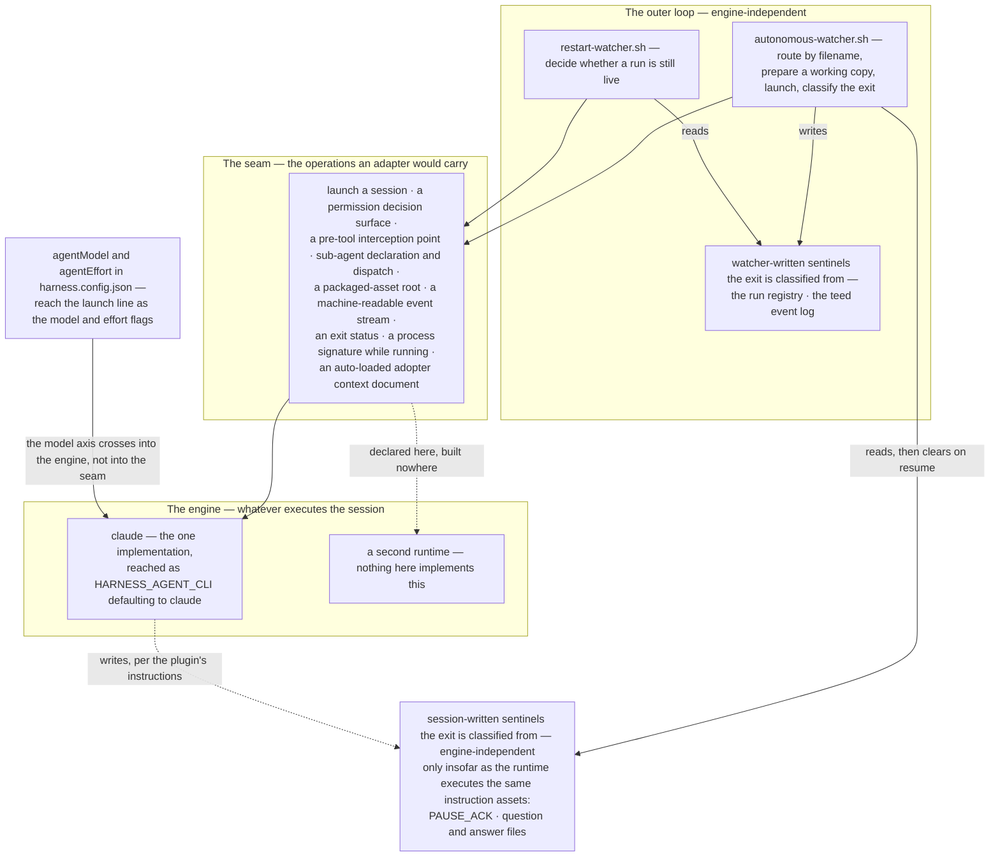

# Architecture

**Who reads this:** someone evaluating the harness's direction out of its first named limit — that it runs on one engine — and who will read the code beside this file rather than take the file's word for it.

This document cuts the system along one axis: how the harness reaches whatever runs it, where that binding sits today, and what putting a second runtime behind the same outer loop would take. **[shipped]** No second engine, adapter module or configuration key for one is built, prototyped or spiked in this release. It is a design document written to be checked against the tree, and §2's markers say of every claim below whether it describes the tree as it is or as it is intended.

---

## 1. What this document owns

The one cut this file makes is the **engine axis** — the sites at which the harness reaches its runtime, how tightly each one is bound, and the contract a second runtime would have to satisfy. **[shipped]** No other document in this tree makes that cut: each of the files below owns a different subject, and this one links to them rather than restating them.

- **[shipped]** [`README.md`](README.md) — what the two halves ship, and the scope-and-limits list. Its *Claude-bound today* bullet states the current position in one paragraph; this document expands that bullet and does not restate it.
- **[shipped]** [`docs/watcher.md`](docs/watcher.md) — the outer loop's behaviour: what a dropped file becomes, which script does what, the daemon's lifecycle, and the machine-level usage lane.
- **[shipped]** [`docs/cli.md`](docs/cli.md) — the four subcommands, their flags, exit codes and re-run contract.
- **[shipped]** [`docs/config.md`](docs/config.md) — one row per configuration value and parameterization token, and where each one's value comes from.
- **[shipped]** [`schemas/README.md`](schemas/README.md) — the configuration boundary: what belongs in the committed configuration file and what belongs in machine-local state.
- **[shipped]** [`plugin/docs/AUTONOMOUS_FLOW.md`](plugin/docs/AUTONOMOUS_FLOW.md) — the inner loop: the phases a run walks, the artifacts it writes, and what it promises when it stops.
- **[shipped]** [`docs/development.md`](docs/development.md) — the contributor gates a change must pass, and the roadmap legend every item number cited in this tree resolves against.
- **[shipped]** [`docs/outer-loop-verification.md`](docs/outer-loop-verification.md) — how the outer loop is tested, and — in `## 0. Method and fixtures` → *The agent stub* — **why the agent binary is reached through a variable at all**. Sections below cite that reason rather than re-arguing it.
- **[shipped]** [`docs/guard-verification.md`](docs/guard-verification.md) — the composed `PreToolUse` guard set's standing decision matrices and its per-call cost.
- **[shipped]** [`docs/typecheck-key-decision.md`](docs/typecheck-key-decision.md) — whether `commands.typecheck` stays a required configuration key, with three options weighed on the same five dimensions; option (b), the explicit `none` sentinel, is ratified and implemented.

## 2. How to read the status markers

This document describes the system partly as it is and partly as it is intended, and those two must never be indistinguishable to a reader deciding whether the direction is credible. Every sentence making a claim about the system therefore opens with one of three markers:

- `**[shipped]**` — true of the tree as it stands, and checkable in it.
- `**[designed]**` — intended, reserved or specified, and not built here.
- `**[external]**` — taken from a source outside this repository, and its provenance stated where it is used. It is stated **by class** rather than by path, because a source outside this repository is one this tree may not name a path to.

The markers bind **sentence by sentence**, not section by section: a marked sentence covers itself and nothing after it. An unmarked declarative sentence about the system is a defect in this file, not an implicit `**[shipped]**` — read a missing marker as an error and check the claim against the tree. Sentences about this document's own conventions, and its headings, make no claim about the system and carry no marker.

**One spelling rule follows, and binds every section.** Slash commands are named here by their identifier — `ENGINE_COMMAND_TASK` rather than the command string it holds. **[shipped]** The tree's sweep of command spellings has run: the rule it applied and the check that holds it, gate 6d, are [`docs/development.md`](docs/development.md) `## 5. Verifying a change` → gate 6, and the route of the three watcher strings those identifiers hold is the measured one recorded in `## 6. The roadmap this tree defers to`, in its paragraph opening *A third debt belongs to no row at all*. Naming commands by identifier here keeps this file independent of that route.

## 3. The word "engine" in this tree

**[shipped]** The word carries two senses inside the shipped tree itself, and the same file uses both.

**[shipped]** **Sense A — the launched session, and the runtime that executes it** is the dominant one in the watcher's own prose: `cli/templates/scripts/autonomous-watcher.sh` names its launch helper `spawn_engine` under a header block reading *"Spawn the headless engine in an ALREADY-PREPARED working copy"*, describes that helper as *"one detached subshell running one headless engine session"*, states its own job as turning a dropped file *"into an unattended engine run"*, and warns that taking a run's exit status from the end of its launch pipe rather than from `PIPESTATUS[0]` would make classification *"read the formatter's status instead of the engine's"* rather than *"the engine's real exit code"*.

**[shipped]** **Sense B — one of the three flow commands a dropped filename binds to** lives in three identifiers and one registry field of that same file — `ENGINE_COMMAND_TASK`, `ENGINE_COMMAND_USER_REVIEW`, `ENGINE_COMMAND_DOCS`, and the per-run `engine` field whose header gloss is *"which engine each run was launched with"* — and in [`plugin/docs/AUTONOMOUS_FLOW.md`](plugin/docs/AUTONOMOUS_FLOW.md) `## Out of scope in this release`, which calls the watcher *"a thin adapter over the engine commands"* whose later trigger would feed *"the **same** engines"*.

This document uses "engine" in **sense A** only, and says "flow command" where sense B is meant. **[shipped]** That choice agrees with the watcher's own prose and differs from those three identifiers, from the registry field, and from the flow document's phrase. **[shipped]** The collision is recorded here rather than renamed: renaming a shipped identifier, or the registry field a run's record is written with, would change code and on-disk run records that this document only describes.

## 4. Two axes: which runtime, and which model

**[designed]** A run is two choices, not one — **which runtime executes the session**, and **which model that runtime talks to** — and this document holds them apart as separate axes, because a design that conflates them can express neither *the same runtime against a different model* nor *the same model under a different runtime*, and both are ordinary asks. **[shipped]** The tree names one of the two. **[shipped]** It carries a second run setting, `agentEffort`, and that setting sits **on** the model axis rather than beside it as a third: it is a property of how the model is invoked, reaching the same launch line from the same file — so a reader who greps the schema and finds two run settings is reading one axis with two dials, not a third axis this section failed to name.

**[shipped]** **The model axis is a configured value with a whole path:** `agentModel` in `harness.config.json` — schema default `opus` — is read by `hr_agent_model` in `cli/templates/scripts/lib/harness-run-lib.sh`, assigned to `AGENT_MODEL` in `cli/templates/scripts/autonomous-watcher.sh`, and reaches the launch line as a conditional `--model` from the `model_args` block. **[shipped]** `agentEffort` walks that same path with one part deliberately absent: a schema entry carrying **no** default, read by `hr_agent_effort` in the same library, assigned to `AGENT_EFFORT` in the same script, and reaching the launch line as a conditional `--effort` from the `effort_args` block beside it. **[shipped]** Both are conditional for one reason the watcher states once — *"Each flag is omitted rather than passed empty, so the CLI applies its own default instead of failing on a blank value."* — but the two guards are not the same kind of thing, and the difference is the section's point rather than an aside: the model's guard is **defensive**, because the watcher refuses to start on a configuration it cannot load and `hr_agent_model` carries the schema default, so an empty `AGENT_MODEL` is not a state a configuration can reach; the effort guard is the **load-bearing** one, because its reader carries no default and an unset key is the ordinary case. **[shipped]** `agentModel`'s own row is [`docs/config.md`](docs/config.md) `## 5. Key reference` and its token and resolution class are that file's `## 4. Token → class → home`; `agentEffort`'s row is in that same key reference and it mints no token — this section links to both rather than restating what either value means.

**[shipped]** **The engine axis is not a configured value at all:** no key in `harness.config.json` names the runtime the outer loop launches — no `engine`, `runtime`, `backend`, `agentCli` or equivalent. **[shipped]** Re-derive that rather than take it from here — from this folder's root, `grep -nE '"(engine|runtime|backend|agentCli|agent_cli)"' schemas/harness.config.schema.json`, whose invariant is **no output**. **[shipped]** The schema's only `provider` is `deploy.provider`, *"Name of the hosting provider the wrapper deploys to"* — the deploy wrapper's hosting target, a different axis entirely — so a reader who greps the schema for `provider` should dispose of that hit rather than read it as a contradiction.

**[shipped]** What the engine axis has instead is **one environment variable, `${HARNESS_AGENT_CLI:-claude}`, resolved once per script and read in two shipped scripts**: `AGENT_CLI` in `cli/templates/scripts/autonomous-watcher.sh`, the binary the launch line executes, and the `agent_probe` basename in `cli/templates/scripts/restart-watcher.sh`, the in-flight process probe. **[shipped]** In neither is it a configured value — nothing writes it, it appears in no schema, and `doctor` carries no check of it. §5 inventories both reads as rows and states what each one binds.

**[shipped]** A further literal `claude` sits in `cli/src/commands/init.ts`, as `AGENT_CLI`, and it is **not** an execution site: it is a string composed into the closing report for a person to paste, which that constant's own documentation states — *"Both are strings a person retypes: this CLI executes neither"* — and which the report's note draws out against the generated watcher's `${HARNESS_AGENT_CLI:-claude}`, *"an override that belongs to a script's own environment and would mean nothing on a line printed for a person to paste."* **[shipped]** A grep for `claude` across `cli/src/` therefore over-states the engine coupling unless hits of that kind are disposed of.

**[shipped]** The asymmetry is this section's finding: one axis is a first-class configured value with a schema entry, a default, a typed reader and a documented row, while the other is an environment variable that two scripts read and nothing sets. This document does not treat that asymmetry as a defect to fix in this release; §8 states the rule it follows instead, and why adding an `engine` key here would be the wrong move rather than the obvious one.

## 5. Where the engine is reached — the launch path

This section and §6 are one inventory in two halves: this one covers every site the outer loop's launch and exit paths bind, §6 the assets and configuration a run is handed. **[shipped]** [`docs/watcher.md`](docs/watcher.md) `## 1. The loop in one page` and `## 2. The scripts` own what the loop does and which script does it; this section adds only the engine-coupling reading of those same sites and links rather than restating.

**[shipped]** The sites below are derived, not recalled. Re-run the derivation from this folder's root:

```
grep -rnE 'HARNESS_AGENT_CLI|AGENT_CLI|ENGINE_COMMAND_|--output-format|--permission-mode|--settings|--add-dir|rate_limit_event|PIPESTATUS' cli/templates/scripts/ cli/src/
```

Its invariant is not a count — no expected hit count is written anywhere in this file — but a covering property: **every site it reaches is a row below, or is named here as owned by another section.** If it reaches a site no row covers, the table is wrong and takes a new row; narrowing the command until it matches the table is the failure this invariant exists to catch. **[shipped]** Two of the files it reaches are dispositioned in this sentence rather than given rows: `cli/src/commands/init.ts`'s `AGENT_CLI` is the pasteable string §4 has already disposed of, and `cli/src/generators/permissionProfile.ts`'s two `--settings` mentions describe the generated permission profile, whose row is §6's.

The table's cells carry no per-sentence marker; its columns carry them instead. **[shipped]** Every cell of **Site**, **What it binds** and **How engine-bound** describes the tree as it stands and is checkable in it. **[designed]** Every cell of **What a second runtime must supply** states a requirement on a runtime that does not exist here, and none of it is built.

| Site | What it binds | How engine-bound | What a second runtime must supply |
|---|---|---|---|
| `cli/templates/scripts/autonomous-watcher.sh` → `AGENT_CLI`; `cli/templates/scripts/restart-watcher.sh` → `agent_probe` | The name of the executable the loop runs, resolved once per script from `${HARNESS_AGENT_CLI:-claude}` — the watcher executes it, the restart wrapper takes its basename. | Loosely, and it is the only already-indirected site in this table. Why the indirection exists is owned by [`docs/outer-loop-verification.md`](docs/outer-loop-verification.md) `## 0. Method and fixtures` → *The agent stub*, and the reason there is testability, not vendor neutrality. | An executable name. This is the one row a second runtime already fits without a change. |
| `autonomous-watcher.sh` → `spawn_engine`, and the flag string written out in full in the header block above it | The invocation: `-p` with the launch prompt, `--settings`, `--permission-mode`, a conditional `--model`, a conditional `--effort`, `--output-format stream-json --verbose`, and two `--add-dir` arguments — the run's worktree and the main checkout's state directory. | Tightly, and by name: every one is one CLI's spelling. Two of them name a file format and a mode rather than only a value, which the paragraph on `--settings` and `--permission-mode` below takes up. | An equivalent for each, including the two whose arguments are a format and a mode rather than a path. |
| `autonomous-watcher.sh` → `launch_prompt` in `spawn_engine`, and the constants `ENGINE_COMMAND_TASK`, `ENGINE_COMMAND_USER_REVIEW`, `ENGINE_COMMAND_DOCS` | The first message: a trusted instruction naming one of three slash-command identifiers, plus the dropped artifact's **file path** — which the header block records as the delimiting property, since that text is never concatenated into the trusted instruction layer. | Tightly, and the paragraph on the first message below says why the command form and the plugin that resolves it are one coupling rather than two. The delimiting property is not engine-bound and survives any runtime. | A first message that can address a named flow, and a mechanism that resolves that name to the flow's instructions. |
| `cli/templates/scripts/autonomous-format-stream.sh` (its header and its `REPRO` block), read a second time by `autonomous-watcher.sh` → `usage_read_run` | The `stream-json` event schema: `assistant` events whose `message.content[]` entries are `text` or `tool_use` (descriptor taken from the first of `subagent_type` / `description` / `command` / `file_path` present), `thinking` and `tool_result` bodies dropped, a final `result` envelope carrying `subtype`, `num_turns`, `total_cost_usd` and `usage`'s four-way token split, and `rate_limit_event` events carrying `rate_limit_info` with `status`, `rateLimitType` and `resetsAt`. | Tightly, and behaviourally rather than cosmetically: the formatter alone would only cost readability, but the usage gate parses the same teed stream to decide whether to pause, and [`docs/watcher.md`](docs/watcher.md) `## 4. Pausing, parking and the usage gate` owns that policy. A line that is not JSON is a deliberate no-op. | An event stream a filter can reduce to one line per event, and — separately — a rate-limit signal on it, without which the gate has nothing to assess. |
| `autonomous-watcher.sh` → `classify_run_exit`, and the `rc=${PIPESTATUS[0]}` line in `spawn_engine` whose comment requires the status come from the head of the pipe and never its end | A process exit status, and four filesystem signals: the `stall_killing` registry flag, `PAUSE_ACK`, the `question_<n>.md` / `answer_<n>.md` pairing, then `rc -eq 0` against non-zero. | Barely — this is the negative result stated in full at the end of this section. | A process that exits with a status. Nothing else. |
| `restart-watcher.sh` → `agent_probe` and its `pgrep -f "${agent_probe}[ ]-p"` probe | More than the launch site does: the binary's **basename**, the `-p` headless flag, and the presence of the main checkout's path or the `<work_root>/<projectName>-` worktree prefix in a running process's argument vector, all read back out of `ps -ww -o args=`. | Tightly, and silently. The header calls the probe *"a BACKSTOP"* to the run registry, so a runtime with a different binary name, a different headless flag or a different way of naming its readable roots does not error — it returns a wrong liveness answer, and the guard that refuses to restart over a live run fails open. | Either a matchable process signature — basename, a headless flag, and a path argument that identifies the repository — or a decision to make the run registry the sole liveness source and drop the backstop. |

**[shipped]** Two flags in the invocation row name more than a value. `--settings` names a **file in a format**, the permission profile the CLI generates, whose own row is §6's; and its argument is `SETTINGS_PROFILE`, a fixed `.claude/` dot-path under the main checkout rather than a path derived from the configured `stateDir` the way every run-artifact path in that script is. **[shipped]** `--permission-mode` names a **mode**: `PERMISSION_MODE="${PERMISSION_MODE:-acceptEdits}"`, whose comment records that a permission-bypass mode is deliberately never used, because the generated profile's deny floor is what keeps an unattended run in its lane and bypassing it would make every refusal decorative. **[designed]** An adapter that translated the rest of the flag string and skipped these two would launch a session that looked correct and had no containment, so both are contract items rather than defaults a second runtime may supply later.

**[shipped]** The first message is not free text with a command embedded in it: it is a sentence naming one of three slash-command identifiers, and what resolves that name to a flow's instructions is the installed plugin. **[designed]** The command form and the plugin mechanism are therefore one coupling and not two — a second runtime owes both halves, and supplying a first-message channel without a name-resolution mechanism buys nothing. **[shipped]** Measured rather than reasoned, and recorded elsewhere: [`docs/development.md`](docs/development.md) `## 6. The roadmap this tree defers to`, in the paragraph opening *A third debt belongs to no row at all*, reports that on Claude Code 2.1.274 a headless session runs the prefixed spelling directly and reaches the unprefixed one only through the model's `Skill` tool call, and that a first message naming the task flow's command emitted no `Skill` call in either spelling, so the watcher's strings keep the unprefixed route. Read that paragraph for the measurement and its versions, rather than this sentence's summary of it.

**[shipped]** The honest negative result of this inventory is that exit classification is its least engine-bound site, and recording that is the point of an inventory rather than a diagram. **[shipped]** `classify_run_exit` branches, in this order, on the `stall_killing` flag in the harness's own run registry, on the `PAUSE_ACK` file a run writes when it honours a pause, on an unanswered `question_<n>.md` in the clarification channel, and only then on `rc -eq 0` against non-zero — and every one of those four but the last is a **filesystem sentinel rather than anything the engine's own protocol supplies**. **[shipped]** They do not share an author: `stall_killing` is the watcher's own (`registry_set "$b" stall_killing 1` in its watchdog pass), while `PAUSE_ACK` and `question_<n>.md` are written by the **session**, under the plugin's instructions — the watcher reads them and later removes them under a comment headed `FILE-LIFECYCLE OWNERSHIP`, and calls one of them *"engine's PAUSE_ACK"* outright. **[shipped]** Only the exit status comes from the engine, and only as a number: the function reads no transcript, no structured completion payload and no exit reason. **[designed]** Stall and completion therefore survive an engine change untouched — that is the part of the outer loop a second runtime gets for free, and a section that listed only couplings would have hidden it. **[designed]** Pause and park do not come free in the same way: their sentinels are written by whatever session the second runtime runs, so they survive exactly insofar as that runtime resolves and executes the same instruction assets — operation 5's coupling, not the absence of one.

## 6. Where the engine is reached — assets and configuration

§5 covered one process invocation. This half covers the larger surface the **assets** bind: how they are packaged and found, how one asset names another, how a sub-agent is declared and dispatched, how tool permission is expressed, how the guard hooks are called, and which part of an adopter's repository the harness writes into a fixed dot-namespace. **[shipped]** [`docs/development.md`](docs/development.md) `## 1. Source types and the plugin root`, `## 2. The one authoring rule that follows` and `## 3. Manifest facts a contributor must not rediscover` own the packaging mechanics and the measurements behind them; this section adds only the engine-coupling reading of the same sites and links rather than restating. No site §5 gave a row takes one here.

**[shipped]** The sites below are derived, not recalled. Re-run all three from this folder's root:

```
grep -rl 'CLAUDE_PLUGIN_ROOT' plugin/ cli/
grep -rn '^tools:\|^model:' plugin/agents/
grep -rn "'\.claude" cli/src/
```

The invariant is §5's, and no expected hit count is written anywhere in this file: **every site they reach has a row below, or is disposed of by name here.** A command reaching a site no row covers means the table takes a new row, never that the command should be narrowed. Each site below is disposed of by name rather than given a row:

- **[shipped]** `plugin/commands/*.md` — the flow-command definitions. Their engine coupling is §5's first-message row, which binds the command form and the mechanism that resolves a flow name as one thing; what this table adds for them is only the packaging and token rows every asset shares.
- **[shipped]** `cli/src/generators/permissionProfile.ts` — and its compiled twin under `cli/dist/`, which is build output rather than a source site — together with `cli/templates/claude/settings.autonomous.qa.json` carry the token in **prose** rather than in a reference: both explain why a generated permission entry cannot name a path through it. The permission-model row owns that, and the paragraph on it below.
- **[shipped]** `cli/templates/state-dir/**` — run-artifact README prose written into the adopter's configured state directory, which dereferences plugin assets by the same token. The asset-reference row covers it.
- **[shipped]** `cli/src/commands/init.ts`'s hit is `.claude-plugin`, not `.claude`: it is `MARKETPLACE_MANIFEST`, one of the two signals by which `init` recognises **this** repository and refuses to wire it. The packaging row covers it.

The table's cells carry no per-sentence marker; its columns carry them instead. **[shipped]** Every cell of **Site**, **What it binds** and **How engine-bound** describes the tree as it stands and is checkable in it. **[designed]** Every cell of **What a second runtime must supply** states a requirement on a runtime that does not exist here, and none of it is built.

| Site | What it binds | How engine-bound | What a second runtime must supply |
|---|---|---|---|
| **Packaging and distribution** — `plugin/.claude-plugin/plugin.json` and the repository-root `.claude-plugin/marketplace.json` | Identity and discovery: the plugin name `autonomous-sdlc-harness` and the marketplace name `autonomous-sdlc-harness` — two distinct names that deliberately coincide, so the `<plugin>@<marketplace>` composite doubles and must not be collapsed (`cli/src/generators/projectSettings.ts`, `PLUGIN_KEY`) — the single entry sourcing the plugin as `./plugin`, and the two fixed dot-directory locations a host looks in. `plugin.json` is the sole version of record; the marketplace entry deliberately carries no `version`. | Tightly, and structurally — the directory names, the file names and the field set are one host's. `claude plugin validate --strict` is the only thing that reads them **as a format** ([`docs/development.md`](docs/development.md) `## 5. Verifying a change`, gate 1). The CLI package reaches them three times and never as a reader of that format: `cli/src/core/pluginIdentity.ts` **mirrors** the plugin name into `PLUGIN_NAME`, and `cli/src/generators/projectSettings.ts` the marketplace name into `MARKETPLACE_NAME` and both into their composite `PLUGIN_KEY`; `init.ts` tests the marketplace manifest's **path** for the self-adoption refusal; and `cli/test/init.test.mjs` parses both files for their `name` fields alone, deriving the expected `enabledPlugins` key — and the `<plugin>:branch-prompt` skill name the rendered task-offer file must carry — from them rather than from a literal: the drift check on that mirroring, which `claudeContext.ts` also renders `PLUGIN_NAME` through rather than repeating the slug in a template. | A packaging and discovery format of its own — and, because those two names are mirrored into a settings key in the adopter's repository rather than read at run time, an equivalent of that key **and** of the check that keeps the mirror and the manifests in agreement. Publishing one asset tree to two hosts is a decision this row forces, not one it answers. |
| **Asset reference resolution** — `${CLAUDE_PLUGIN_ROOT}`, the token every intra-plugin reference is written with (`plugin/README.md`: *"the only form that resolves under both a git-sourced install and a directory-sourced one"*) | How one asset names another, across every asset type the first derivation command reaches. The runtime substitutes it, and it resolves to a version-pinned cache directory for a git-sourced install; a directory source is **also** installed as a snapshot copy under that same cache, so the contributor's edit loop carries a refresh rather than being live (`docs/development.md` `## 1. Source types and the plugin root`). | Tightly, and with both legs measured rather than one left open: `docs/development.md` `## 2. The one authoring rule that follows` records the substitution for **agent definition bodies** and hook `command` strings, and records that a file an agent opens with `Read` — an instruction or a sample — arrives **unsubstituted**, the agent resolving the root itself; `## 3. Manifest facts a contributor must not rediscover` records the helper invocations that closed the same question from the permission side. A second runtime inherits both halves with the token. | A root token with the same two-source property and a substitution point at least as wide as the asset types that use it. Relative paths are not the fallback — §1 of that document says why the two roots make them wrong. |
| **Sub-agent declaration and dispatch** — `plugin/agents/*.md` frontmatter (`name`, `description`, `tools`, `model: inherit`), and the discovery rule `plugin/agents/README.txt` records | A dispatchable role: the name a flow dispatches by, the description a caller selects on, a per-agent tool closure, and a model axis resolved by **inheriting the session's** rather than being configured per agent. Discovery loads every `.md` in that directory as an agent, which is why its README is `.txt`. | Tightly, and at the **primitive** rather than the file format: the inner loop is one session dispatching sub-agents, so a runtime without that primitive has nowhere to put these files. The `tools:` allowlist is the sole enforcement of the browser closure — `docs/development.md` §5's closing paragraph: *"An agent added without a `tools:` field inherits the full default tool set"* — and that paragraph also says why a `permissions.deny` backstop cannot substitute for it. | A sub-agent primitive at all; then a declaration format carrying a dispatch name, a selection description, a per-agent tool closure that is **enforced** rather than advisory, and a model axis that can defer to the session's. |
| **The permission model** — `cli/templates/claude/settings.autonomous.json` and `settings.autonomous.qa.json`, generated by `cli/src/generators/permissionProfile.ts` (`TEMPLATE_PATH`, `QA_TEMPLATE_PATH`, `PROFILE_PATH`) | The whole grant surface of an unattended run: a `permissions` object with `allow`, `deny`, `ask`, `defaultMode` and `additionalDirectories`; `enabledMcpjsonServers`; and the `mcp__<server>__<tool>` entry grammar the generator both writes and checks itself against (`ENABLED_SERVERS_KEY`, `MCP_ENTRY_PREFIX`, `MCP_SERVER_PATTERN`). Entries are matched against the **raw command string**, so their form is load-bearing: one command per entry, script paths unquoted, every caller-spelling listed. | Tightly, and the one row where a partial equivalent is worse than none — the paragraph below states why. §5's `--settings` row names the flag that selects this file; this row is the file and its format. | An exhaustive grant model, generator-writable, with per-tool entries, readable-root declarations, and a deny that a narrowing sub-agent closure **composes with** rather than overrides. |
| **The tool-guard envelope** — `plugin/hooks/hooks.json` → `hooks.PreToolUse[]` with `matcher: "Bash"`, and each guard's I/O, e.g. `plugin/hooks/git-commit-branch-guard.sh` → its `REPRO` block and `emit` | When a guard runs and how it answers: an interception point before a tool call, a matcher naming the tool, a `command` string (itself token-resolved), a JSON payload on stdin carrying `tool_input.command` and `cwd`, and a reply carrying `hookSpecificOutput.hookEventName`, `permissionDecision` and `permissionDecisionReason`. Silence — exit 0, no output — is a third answer and not an error. | The **envelope** only, and that split is this section's most consequential finding; the paragraph below states it. One structural property comes with it: hooks declared here **append to** an adopter's own rather than overriding them, which is why the guards ship in this file rather than in generated settings. | A pre-tool interception point that can see the command, answer allow / ask / nothing, and compose with the adopter's own hooks. The guard bodies themselves come across unchanged. |
| **The adopter's `.claude/` namespace** — `projectSettings.ts` (`CLAUDE_DIR`, `SETTINGS_PATH`, `ENABLED_PLUGINS_KEY`, `MARKETPLACES_KEY`), `claudeContext.ts` (`CLAUDE_MD_PATH`, `QA_SCENARIOS_PATH`, `TASK_OFFER_PATH`), `permissionProfile.ts` (`PROFILE_PATH`), `harnessConfig.ts` (`QA_CREDENTIALS_PATH`, `PUSH_ENV_PATH`), `detect/presets.ts` (`CONVENTIONS_DIR`) | A host-named directory in **someone else's** repository, and what `init` writes inside it: the committed project settings that enable the plugin, the auto-loaded context document, the change-request offer rules at `.claude/harness-task-offer.md` its fence reads on demand, the per-layer conventions documents, the interactive-test scenarios, the unattended permission profile, and the two gitignored `*.env` paths. Unlike the configurable `stateDir`, the dot-name is fixed. Templates ship at `cli/templates/claude/` **without** the dot and `init` adds it at the adopter's end — `docs/development.md` §5 gate 6 makes a committed dot-directory here a failure. | Tightly, and by name: the directory is one host's convention, and every path above is composed from a constant holding it. Two consequences of that fixed name are measured and recorded rather than argued, and both sit in one paragraph of [`docs/analyze.md`](docs/analyze.md) `## 3. What it may write`, the one opening *Any write under a repository's own `.claude/` tree is a supervised action* — that `.claude/**` is treated as a sensitive path `--permission-mode acceptEdits` does not cover, evaluated ahead of the generated profile's allow entries so that **no `permissions.allow` entry can grant it**, and that an unattended first run of the conventions-refinement command therefore completed with **exit 0 having written nothing**. Read that paragraph for both, and for the version they were measured on. | Its own namespace; a mechanism that loads a root instruction document out of the **adopter's** repository into every session and every dispatched sub-agent **without any agent definition or instruction asset naming it**, since nothing under `plugin/agents/` or `plugin/instructions/` does and the document's own text is written on that assumption — §7's operation 9 states it and carries the evidence; plus a decision this design defers: whether an adopter wired for two runtimes carries two such directories, or one shared tree with per-runtime files inside it. |

**[shipped]** The guards divide cleanly, and that division is worth more than the row that names it. Their **policy** is engine-independent shell reading the adopting repository's own `harness.config.json` through `plugin/hooks/lib/harness-config-lib.sh`: the protected set as *(`protectedBranches`, else the schema default)* ∪ *{`defaultBranch`}* matched as globs; `hc_branch_is_protected`'s **three-state** answer, whose *unresolvable* may never become an `allow` within jurisdiction; the jurisdiction rule that a repository with no configuration gets silence rather than an opinion; and `DENY_SCRIPT_BASENAMES` in `autonomous-script-allowlist-guard.sh`, which withholds the deploy wrapper and the three outer-loop scripts from an unattended run. **[shipped]** Only the **envelope** is engine-shaped — the registration file, the matcher, the payload's field names and the reply's. **[shipped]** [`docs/guard-verification.md`](docs/guard-verification.md) `## 2. Standing decision matrices` owns each guard's answers and `## 1. Whole-set latency baseline` their per-call cost; neither is restated here. **[designed]** What follows for a second runtime is asymmetric: one offering any pre-tool interception point reuses the guard bodies nearly whole, because the deciding half is shell over a JSON file; one offering none loses the containment outright, and that is a harder problem than the launch line, since nothing else in the harness stands between an unattended run and an arbitrary command.

**[shipped]** The permission profile is not advisory, and its own `_README` gives the reason in one sentence: *"COMPLETENESS IS LOAD-BEARING: in print mode a tool that is neither allowed nor denied stalls rather than prompting, so `allow` has to cover the whole flow end to end."* **[shipped]** A gap therefore surfaces as a hang rather than an error, which is why that file also fixes entry **form** — one command per entry, never a compound; script paths as unquoted literals; every wrapper listed in each spelling a caller may use — and why the generator refuses its own output when an `mcp__` entry names a server `enabledMcpjsonServers` does not start, or starts one no entry names. **[designed]** An equivalent for a second runtime therefore has to be **exhaustive**, not merely expressive: a defined answer for every tool the flow reaches, in every spelling, and a stated behaviour for the unlisted case. **[designed]** A runtime that prompts on an unlisted tool can carry a smaller profile and pays a different failure; one that stalls, as this one does, cannot. **[shipped]** The browser wiring's *location* belongs to this same namespace question — `cli/templates/repo/mcp.json` is written to the adopter's repository root as `.mcp.json` (`cli/src/generators/repoRoot.ts` → `MCP_PATH`), and the profile's `enabledMcpjsonServers` starts the servers it declares — but what MCP is and is not in this tree, and what an open-standard claim would require of it, is §10's subject and not this section's.

## 7. The seam: what an adapter would have to carry

§5 and §6 inventoried where the engine is reached; this section turns that inventory into a **contract** — the operations a second runtime would have to supply for everything above it to keep working. **[designed]** Every operation below is forced by a row in one of those two tables, and none of it is implemented anywhere in this tree.



**[shipped]** The engine band's second node — *a second runtime* — is a placeholder with no implementation behind it anywhere in this tree: no module, no stub, no branch, and no configuration key that would select one, so the diagram states a shape rather than shipped code. **[designed]** That node is `**[designed]**` in the sense §2 gives the word — it stands for whatever a second runtime would be, named by no candidate here, and reserved rather than built. Every operation named on the seam band is one of the numbered items below, and each is marked `[designed]` there. **[shipped]** The model edge is drawn into the engine and not into the seam because `agentModel` and `agentEffort` are already configured values the launch line passes through to the runtime — two settings on the one axis §4 names, which is that section's asymmetry in the one place this document draws it.

Each operation below is stated as *what it must do*, followed by the inventory row that forces it. An operation with no row behind it would be invention, and none is listed.

1. **Launch a session.** **[designed]** Execute a named binary with a first message, in a working copy the caller has already prepared, with a declared set of additional readable roots — the run's worktree and the state directory outside it — and let that first message address a **named flow** that some mechanism resolves to the flow's instructions. *Forced by* §5's `AGENT_CLI` row, which that table calls *"the one row a second runtime already fits without a change"*; its `spawn_engine` row, which binds the rest of the invocation flag by flag; and its `launch_prompt` row, which binds the first message's form and the plugin that resolves the flow name as one coupling rather than two.
2. **Carry a permission decision surface.** **[designed]** Express a grant model a generator can write and check itself against: per-tool entries matched against the raw command string, declared readable roots, a default mode, and a deny that a narrowing sub-agent closure **composes with** rather than overrides. **[designed]** It has to be exhaustive rather than merely expressive — a defined answer for every tool the flow reaches, in every spelling a caller may use, and a stated behaviour for the unlisted case. *Forced by* §6's **The permission model** row, and by §5's paragraph on `--settings` and `--permission-mode`, which names the flag that selects the file and the mode whose bypass would make every refusal decorative.
3. **Expose a pre-tool interception point.** **[designed]** Call a registered command before a tool call, hand it the command string and the working directory, accept a reply that allows, asks, or says nothing, and append to an adopter's own hooks rather than replacing them. **[designed]** The guard bodies themselves come across unchanged, because their deciding half is shell reading the adopting repository's own configuration; a runtime offering no such point loses the containment rather than reimplementing it. *Forced by* §6's **The tool-guard envelope** row.
4. **Declare and dispatch a sub-agent.** **[designed]** Offer the primitive at all — one session dispatching sub-agents — and then a declaration format carrying a dispatch name, a selection description, a per-agent tool closure that is **enforced** rather than advisory, and a model axis that can defer to the session's. *Forced by* §6's **Sub-agent declaration and dispatch** row, whose binding is at the primitive rather than the file format.
5. **Resolve packaged prompt assets.** **[designed]** Substitute a root token inside asset bodies at read time, with the same two-source property — a version-pinned cache directory for an installed copy, and a snapshot copy under that same cache for a directory source, which is why the contributor's edit loop carries a refresh — and a substitution point at least as wide as the asset types that use it. *Forced by* §6's **Asset reference resolution** row, which also records where this runtime's substitution stops: a file an agent opens with `Read` arrives unsubstituted and the agent resolves the root itself, so a second runtime either substitutes there too or inherits that division of labour along with the token.
6. **Emit a machine-readable event stream.** **[designed]** One JSON object per line, carrying at minimum tool dispatches with an identifying descriptor, assistant text, a terminal envelope with a completion subtype and a usage total, and — separately — a rate-limit signal, without which the usage gate has nothing to assess. *Forced by* §5's `autonomous-format-stream.sh` row, whose binding is behavioural rather than cosmetic because the same teed stream feeds the pause decision.
7. **Exit with a status.** **[designed]** A process exit status, and nothing beyond it: the classifier reads no transcript, no structured completion payload and no exit reason, and the other signals it branches on are filesystem sentinels rather than engine output — one written by the watcher (`stall_killing`), two by the session under the plugin's instructions (`PAUSE_ACK`, `question_<n>.md`), which operation 5 carries rather than this one. *Forced by* §5's `classify_run_exit` row, which the inventory records as its least engine-bound site.
8. **Be identifiable while running.** **[designed]** Either a matchable process signature — a binary basename, a headless flag, and a path argument that identifies the repository, all readable out of a running process's argument vector — or a decision to make the run registry the sole liveness source and drop the process probe entirely. **[designed]** Its failure mode is silence rather than an error: the probe is a backstop, so a runtime it cannot match returns a wrong liveness answer and the guard that refuses to restart over a live run fails open. *Forced by* §5's `pgrep` in-flight-probe row.
9. **Load an adopter's root context document.** **[designed]** Read a document at a fixed path in the adopting repository into every session **and** every dispatched sub-agent, unprompted. **[shipped]** Nothing tells an agent to load the file, so nothing falls back on naming it when the runtime does not auto-load it. Derive that rather than count it: run `grep -rn "CLAUDE\.md" plugin/` and read the output against the invariant it must satisfy — **every hit sits in `plugin/commands/harness-analyze.md` or in the conventions pair (`plugin/agents/conventions-writer.md`, `plugin/agents/conventions-reviewer.md`), and each names `.claude/CLAUDE.md` as that command's own write target, as a member of the corpus set that command grades, or as a carve-out from a grading check — never as a file an agent is told to load as context**, the setup session classifying and filling it section by section instead; `plugin/instructions/` returns none. A hit outside that invariant is the finding, not this sentence. Meanwhile `cli/templates/claude/CLAUDE.md`, the template `init` writes into that namespace, opens its routing section with *"This file is auto-loaded into every agent, which is why it deliberately holds almost nothing"* and `plugin/agents/layer-implementer.md` names *"the adopter's auto-loaded root instruction file and conventions documents"* among the citation targets an implementer may rely on. **[designed]** Its failure mode is silence rather than an error: a runtime without the mechanism runs every agent with none of the adopter's routing table, file-naming rules, agent-authoring `tools:` rule, checkout-root rule or the `## Where a change request runs` fence and its pointer to `.claude/harness-task-offer.md`, which together route a change request to a reviewed run — the rules file itself is read on demand and never auto-loaded — and reports success. *Forced by* §6's **The adopter's `.claude/` namespace** row, whose *What it binds* cell names the auto-loaded context document.

**[shipped]** One of §6's rows yields no operation here, and naming it is part of the trace rather than an omission: **Packaging and distribution** binds where assets and generated files *live* in an adopter's repository, not anything the outer loop calls while a run is up. **[shipped]** **The adopter's `.claude/` namespace** row divides instead of disposing: its fixed location binds a place and yields none, while the auto-load its *What it binds* cell names is a runtime injection and yields operation 9. **[designed]** Each of the two rows poses a question this design defers rather than answers — whether one asset tree is published to two hosts, and whether an adopter wired for two runtimes carries two host-named directories or one shared tree with per-runtime files inside it — and both are stated in the rows themselves.

**[shipped]** What this contract is not: an interface anyone has implemented twice. **[shipped]** It was derived from a single implementation, by reading the sites at which that implementation is reached, and a contract derived from one implementation is a description of that implementation until a second one tests it — the operations above are as likely to be shaped by accidents of the runtime this harness grew on as by anything intrinsic to running an agent session. **[designed]** The first real adapter is what would tell the two apart, and until one exists this section states a hypothesis with its evidence attached rather than a settled boundary.

### What this release does not build

**[shipped]** Six boundaries, stated plainly rather than defensively — they are the honest scope of a design section, not gaps awaiting an apology.

- **No second engine.** **[shipped]** Nothing in this tree launches anything but the binary §5's `AGENT_CLI` row names.
- **No adapter with two implementations.** **[shipped]** There is no module, class or dispatch table behind the seam band of the diagram above; §4 states where the CLI's own literal `claude` sits and why it is not an execution site.
- **No `engine` configuration key.** **[shipped]** The schema names no such key, and §4 carries the command that re-derives that rather than asking a reader to take it from here. §8 states the rule that keeps it out, so its absence is a position rather than an oversight.
- **No MCP server.** **[shipped]** This tree consumes servers an adopter enables and publishes none; §10 owns what that does and does not support claiming.
- **No forge coupling.** **[shipped]** The `forge` key stays declared with no reader and this document adds none, which is [`docs/development.md`](docs/development.md) `## 6. The roadmap this tree defers to`'s standing debt rather than anything §7 changes.
- **No design-source coupling.** **[shipped]** The `design.source` key ships declared with no reader and this document adds none; §8 states the outcome that repeats and what would have to land with the reader, and [`README.md`](README.md) `### The shape of the system` states the adopter-facing half — nothing in this release turns a design file into code.

**[designed]** The reason is positive rather than cautious: implementing a second engine is the reserved scope this document exists to describe, and building a thin version of it now would spend that scope on its least informative half — the launch line, which §5 records as the part an adapter already fits — while leaving the parts that decide whether the idea works at all, the permission surface and the interception point, untried.

**[shipped]** In shipped code the seam declared here is carried by two comments and nothing else. **[shipped]** The generated watcher's header block names the binary indirection as the one place the engine binary is chosen and says in the same breath that choosing a binary is not by itself an engine abstraction, because the flags, the settings-file format, the first-message command form and the event stream are bound too; a second comment, above the launch helper, names the flag string written out there as the engine's invocation contract. **[shipped]** Both point at §5 and §6 by their section titles, and `grep -rn "ARCHITECTURE.md" cli/src cli/templates` finds no third carrier. **[shipped]** Neither comment renames anything, adds a branch or changes behaviour: they are pointers into this document, and the declaration itself lives here.

## 8. Declaring a seam before building it

**[shipped]** This tree has declared a seam ahead of its implementation three times, and the rule below is derived from the first two, whose outcomes differ in exactly one part. **[shipped]** All three are in shipped code and each key carries its row in [`docs/config.md`](docs/config.md) `## 5. Key reference`; one of those two also carries a recorded debt in [`docs/development.md`](docs/development.md) `## 6. The roadmap this tree defers to`, so the rule below is read off the project's own record rather than proposed here. **[shipped]** The third is this release's own — `design.source` — and it is taken at the end of this section as a case the rule decides rather than as evidence for it.

**[shipped]** **`qa.driver` — the pattern with every part present.** The axis along which the interactive-test phase reaches an application is named in `schemas/harness.config.schema.json` as a closed enum with a default — `qa.driver`, `["web-playwright", "mobile-maestro", "mobile-mcp"]`, `default: "web-playwright"`, read only when `phases.qa` is true — and what follows is what makes it a declaration rather than a decoration.

- **[shipped]** **Every value has a named artifact.** Three agent definitions ship under `plugin/agents/`: `qa-tester.md`, `qa-tester-mobile-maestro.md` and `qa-tester-mobile-mcp.md`.
- **[shipped]** **One is implemented and the other two say so themselves**, each opening *"This file is a **declaration**: it reserves the dispatch name, fixes the tool closure, and records what this variant would drive and which contract it would follow."* **[shipped]** Each carries a real `tools:` allowlist — `Read` in both, withheld down to the one tool the stub uses and widened at implementation time — despite driving nothing, so the closure is fixed before the behaviour exists rather than after it.
- **[shipped]** **A mis-configured or unimplemented dispatch fails loudly rather than succeeding silently.** Each declared variant gates on the configured driver and routes a dispatch meant for another one to the variant implementing it **by name**, then returns a single-line `error:` blocker on **every** dispatch, including one for its own driver. **[shipped]** Their own sentence is the reason, and it is the source of this item rather than a gloss on it: *"Stopping loudly is the point. A silent success here would report 'nothing observed' from an application nothing ever reached."*
- **[shipped]** **The key already changes generated output**, which is what makes it a reader rather than a decoration: `cli/src/generators/repoRoot.ts` writes the browser wiring, and `cli/src/generators/permissionProfile.ts` merges the profile's browser half, only when `phases.qa` is on **and** `qa.driver` is `web-playwright`. **[shipped]** A mobile driver gets neither half, and a note in `init`'s report telling the adopter why no wiring was written and what to change to get it.
- **[shipped]** **The configuration is reported when it is unset.** With `phases.qa` on and no `qa.driver`, `checkPhaseSections` in `cli/src/config/check.ts` warns beside the sibling `qa.credentialsPath` clause and names `config set qa.driver <value>`; `config set phases.qa true` prints it in the same breath as it arms the phase, and `doctor`'s `config` check carries it thereafter. **[shipped]** So the state the rule below cares about — a declared axis whose value nobody chose — has an observer, rather than the schema default silently standing in for a decision nobody was asked to make.

**[shipped]** **`forge` — the same pattern missing one part.** The axis is named the same way, `forge`, `["github", "gitlab", "none"]`, and deliberately **without** a default, in the schema's own words *"because nothing reads this key in this release"* — so an absent value reads as *not yet decided* rather than as a silently assumed platform. **[shipped]** [`docs/config.md`](docs/config.md) `## 5. Key reference` carries the row on the principle that a config key costs an adopter nothing until something reads it, and names its reader as the forge coupling rather than any numbered roadmap item; [`README.md`](README.md) `### The shape of the system` states the same for an adopter in its *Forge-agnostic* bullet. **[shipped]** What is absent is the observer: `checkEnum` in the configuration check returns on an absent optional key, and `doctor` carries no check of its own. **[shipped]** [`docs/development.md`](docs/development.md) `## 6. The roadmap this tree defers to` is the debt of record and states both the verdict — *"A key that is declared and never read is the one outcome that principle does not survive"* — and the consequence: *"the one state the principle relies on being visible, the decision not yet made, is the one state neither reporter names."* That decision is consumed here, not re-argued: this section proposes no change to `forge` and schedules none.

**[designed]** **The rule the two cases yield: a seam may be declared before it is built, but only with a reporter — something that observes the declared state and says so.** **[designed]** The corollary is `forge`'s: a declaration whose only reader is prose has no reporter at all, because prose stands over no particular adopter's configuration and cannot name what that configuration left unset.

**[designed]** **Applied to the engine seam, that rule decides this release.** Adding an `engine` key to `harness.config.json` today would create a third key nothing reads and no reporter names, after `forge` and this release's own `design.source` below — the `forge` outcome exactly, and this time with the debt visible in advance. **[shipped]** So the engine axis stays where §4 found it: one environment variable in the generated watcher, `${HARNESS_AGENT_CLI:-claude}`, read by two scripts and written by nothing. **[designed]** The seam is therefore declared in this document and in that script's own header block rather than in the schema. **[designed]** What has to land *with* the key when it does is what `qa.driver` has and `forge` does not: a reader that changes something observable — generated output, a launch line, a dispatch — and a check that names an unset value instead of passing over it, which `qa.driver` gained in this release as a clause of the structural check `doctor` relays rather than as a check of `doctor`'s own. **[designed]** That is design and not a task: no work in this release adds the key, the reader or the check, and nothing here schedules them.

§7's *What this release does not build* states **No `engine` configuration key** as a boundary and points here for why; this section is that reason, so the two resolve against each other rather than each carrying half of it.

**[shipped]** **`design.source` — the same outcome, declared with the rule already written.** The axis along which a project names where its design source of truth lives is declared the way `forge` is: `design.source`, `["figma", "penpot", "none"]`, and deliberately **without** a default, in the schema's own words *"because nothing reads this key in this release"* — so an absent value reads as *not yet decided*, while `none` is a decision rather than an absence, saying the project has no design source at all. **[shipped]** It is one contract in four places, edited together: the schema's property, `HarnessDesign` and `DESIGN_SOURCES` in `cli/src/config/model.ts`, the section and its `checkEnum` call in `cli/src/config/check.ts`, and the row in [`docs/config.md`](docs/config.md) `## 5. Key reference`. **[shipped]** What is absent is the observer, exactly as with `forge`: the structural check speaks only when the key is *present* and is not one of the three — `checkEnum` returns on an absent optional key — and `doctor` carries no check of its own, so the key ships declared and **unreported**.

**[designed]** What would sit behind the seam is a **design token standard plus a frame/node abstraction**, and explicitly not a vendor's MCP server. **[external]** The token half is the **DTCG** format, a design-tokens community group's published interchange format for design tokens, named here by class rather than by path because §2 holds that a source outside this repository is one this tree may not name a path to. **[designed]** An adapter written against that format and a minimal frame/node view of a design file is portable across tools; one written against a particular tool's MCP server couples to that vendor's product surface instead, which is why the seam is stated against a published format — §10 owns what MCP is and is not in this tree, and this block names an interface rather than reopening that. **[designed]** `figma` and `penpot` name the two adapters that would sit behind the seam, and `none` says there is nothing behind it.

**[designed]** **This declaration has the shape the rule above refuses, and this section says so rather than claiming otherwise.** **[designed]** Nothing reads the key and its only reader is prose — this block, the `docs/config.md` row and the debt entry named next — so by that rule's own corollary it has no reporter, and it repeats the **outcome** [`docs/development.md`](docs/development.md) `## 6. The roadmap this tree defers to` records against `forge` rather than `qa.driver`'s. **[shipped]** That section records this key's debt beside `forge`'s, as the same debt in a second instance, and names its reader as the **design-source coupling** — the one [`docs/config.md`](docs/config.md) `## 5. Key reference` names in its row, reading design tokens and frame/node structure into the flow's inputs — rather than any numbered roadmap item, the resolution §6 already reached for `forge`. **[designed]** What has to land *with* that reader is what `qa.driver` has: a reader that changes something observable, and a check that names an unset value instead of passing over it.

**[designed]** No work in this release adds an adapter, a reader, a reporter, an agent variant, an `init` prompt or a phase, and nothing here schedules them.

## 9. The open-weight backend path

§7 states the contract from the adapter's side — the operations something in this repository would have to call. This section reads the same contract from the backend's side and states what follows from it: the properties a runtime must offer for that contract to be satisfiable against it, why reaching open weights is a separate question from reaching a second runtime, the two shapes a candidate can take, and why this document names none of them. **[designed]** Nothing below is selected, prototyped or built in this release.

### What a backend must offer

Each item is a property of a candidate runtime, not a restatement of the operation it answers: §7 says what the harness would have to call, and each item below says what in a runtime decides whether it can be called that way, and what its absence costs. An item answering no §7 operation would be invention, and none is listed.

1. **A non-interactive session mode that is a mode rather than a wrapper.** **[designed]** What is checked is whether a session can be started from outside a terminal and ends by itself; a runtime whose only entry is an interactive front end can be driven but not launched, and operation 1, **Launch a session**, then rests on a scripted TTY that no exit status describes.
2. **A permission surface that is exhaustive, not merely expressive.** **[designed]** The decidable properties are what the runtime does with a tool the profile does not list, and whether a narrowing sub-agent closure composes with a deny or replaces it; rich rules over an undefined default answer operation 2, **Carry a permission decision surface**, for the calls someone remembered and for no others.
3. **A pre-tool interception point that exists at all.** **[designed]** This is the one requirement nothing above the runtime can supply, because a harness cannot intercept a call it never sees — a candidate without the point loses the containment rather than reimplementing it, which makes operation 3, **Expose a pre-tool interception point**, the item that disqualifies a candidate soonest.
4. **A sub-agent tool closure the runtime enforces.** **[designed]** The check is enforcement rather than file format: a declaration a runtime reads and does not enforce leaves operation 4, **Declare and dispatch a sub-agent**, satisfied on paper and open in fact, since the closure is the containment and the format is only how it is written down.
5. **A root that resolves inside asset bodies at read time.** **[designed]** However a candidate spells the token, something has to resolve it while the asset is read; without that, packaged assets can only carry paths fixed when they were installed, and operation 5, **Resolve packaged prompt assets**, is answered by rewriting the assets per adopter instead.
6. **A quota signal inside the event stream.** **[designed]** Line-delimited machine-readable output is common and the quota event is not, and it is the half operation 6, **Emit a machine-readable event stream**, cannot do without: a runtime that reports usage only in its terminal envelope leaves the usage gate nothing to assess until the session it would have paused has already ended.
7. **An exit status that separates completion from failure.** **[designed]** The classifier reads nothing else, so a runtime that exits zero on an aborted session answers operation 7, **Exit with a status**, with a value that is present and wrong — the cheapest requirement to satisfy and the easiest to satisfy incorrectly.
8. **A context injection the runtime performs unprompted.** **[designed]** The decidable property is whether a fixed-path repository document is loaded into every session *and* every sub-agent dispatch by the runtime itself; one that loads it only for the outermost session, or only where an asset names the file, answers operation 9, **Load an adopter's root context document**, for the outermost turn and, silently, for none of the dispatched ones — and no agent definition or instruction asset tells an agent to load the file, so there is nothing to fall back on.

**[designed]** §7's eighth operation, **Be identifiable while running**, sets no requirement on a backend here, because §7 states its own alternative — making the run registry the sole liveness source and dropping the process probe — so a runtime no process signature can match costs a backstop rather than disqualifying itself.

### Reaching open weights is a property of the model axis

**[designed]** Open weights are reached on the **model** axis §4 holds apart, not on the engine axis: a runtime reaches them by talking to a local or self-hosted inference endpoint, which is a different value on the axis `agentModel` already names rather than a different executor. **[designed]** Two consequences follow, and both are why the seam must not fuse the axes — a second engine is not automatically an open-weight path, because a runtime that talks only to hosted vendor APIs reaches no open weights at all; and an open-weight path is not automatically a second engine, because the same executor pointed at a local endpoint is a model-axis change and nothing more. **[designed]** Fusing them would cost in both directions: an open-weight claim would then wait on shipping a second runtime, and any second runtime would arrive carrying an open-weight claim it may not support.

### Two shapes a candidate can take

**[designed]** Two classes of backend can satisfy the requirement set above, and they differ in where the work sits rather than in what the work is. They are stated as classes because the choice between them is structural, and because a product named in this section would be read as the interface rather than as one value behind it.

- **(a) A full open reimplementation of the session runtime.** **[designed]** The class is defined by rebuilding the runtime itself, so a member of it answers most of the requirement set by construction — the non-interactive mode, the permission surface, the interception point and the sub-agent primitive are what it is — leaving the adapter mapping rather than building, which is the shorter path to a working second engine. **[designed]** Whether any particular project answers them *as this contract needs them* is a question about that project's source rather than about the class, and it is the question the audit named below is for. **[designed]** The class's own cost is a dependency: the second engine then moves at another project's release cadence, and a pause in that cadence is a pause in this one.
- **(b) A thinner agent loop driving an OpenAI-compatible local inference server.** **[designed]** An inference endpoint supplies the model side and little else, so the permission surface, the interception point, the sub-agent closure and the event stream are built in this repository instead of inherited — fewer items answered, and more work before the first run. **[designed]** What it buys is the absence of a single upstream: the API shape it targets is implemented by several independent servers, and the loop above it is this repository's own.

**[designed]** Class (b) is named here as the **fallback**, and a fallback is required rather than merely prudent: dated work cannot hinge on another project's release cadence, so a path depending on no single upstream has to exist beside the shorter one. **[designed]** Naming the fallback as a class discharges that requirement without selecting a project — which is the next subsection's subject.

### Why no candidate is named here

**[shipped]** No audit of any candidate runtime's source exists in this tree or behind this document, and no file in it names a candidate. Four reasons hold that position, and it is a decision rather than an omission.

- **[external]** Everything currently known about the leading candidate is a read of its published documentation rather than an audit of its source, and a working note held outside this repository already lists five specific claims a source read would have to settle before any of them is published. **[shipped]** Nothing of that note is in this tree, which is why the claim carries the `**[external]**` marker §2 defines rather than a `**[shipped]**` one a reader could check here.
- **[designed]** A public architecture document is durable text, so a third project named in it is a standing claim about that project rather than a working note that ages privately — and an absence claimed from documentation and contradicted by the source is the most damaging error a document of this kind can carry.
- **[designed]** Naming one implementation inside the section that defines the seam is precisely what makes a reader take that implementation for the interface, which the seam's genericity rules out: §7's contract is stated against no runtime, and this section keeps it that way.
- **[designed]** The place where a candidate is named is a funding application's milestone wording — a document outside this repository and outside this release's scope. This section supplies the path such a document would select from, not the selection.

**[designed]** What the naming will require when it happens is the source audit itself, those five claims checked against the repository rather than read again from its documentation; until then the requirement set above is the instrument a candidate is judged with.

## 10. MCP as the open-standard surface

§6 placed the browser wiring's *location* in the adopter's dot-namespace and deferred to here what MCP is and is not in this tree. This section answers that in the order that keeps the answer honest: what this tree does with MCP today, then the argument for MCP as the surface a user on another runtime could consume, then what would have to be built for that argument to describe this repository rather than a direction.

### What MCP is here today

**[shipped]** This repository **authors no MCP server**. **[shipped]** It **consumes** browser-automation servers, each a third-party package pinned to an exact version and launched over `stdio`, declared in one template — `cli/templates/repo/mcp.json` — that `init` writes at the adopter's repository root as `.mcp.json`.

**[shipped]** The sites below are derived, not recalled. Re-run all three from this folder's root:

```
grep -n '"type": "stdio"' cli/templates/repo/mcp.json
grep -n '"mcp__' cli/templates/claude/settings.autonomous.qa.json
grep -rn 'mcpServers' plugin/ cli/src/ | grep -v templates
```

**[shipped]** The first emits the whole of what this tree declares and the second the whole of what it allows to be called; the third emits only *readers* of that template's key — the generator that writes the file and the `doctor` check that reads it back — and no server this project implements. **[shipped]** No expected hit count is written here, for §6's reason: a hit no sentence below covers means this section takes another sentence, never that the command should be narrowed.

Four properties follow, each read off the file that carries it.

- **[shipped]** **Pinned deliberately, because the surface is not this project's.** The template's `_comment` states that its versions are pinned because a browser-automation server's *"tool names and flags change between releases"* and an unpinned fetch *"would change what the phase can do without any edit here"* — and that the declared servers are separate browser instances, *"each launches and drives its own browser, so a page one of them has navigated or signed in is not visible to the other"*. **[shipped]** Both facts are a consumer's, not a publisher's: this tree tracks a surface someone else versions.
- **[shipped]** **Conditional, so an adopter who never drives a browser gets no MCP wiring at all.** The template is written *"only when the QA phase is enabled and its `qa.driver` is `web-playwright`"* (`cli/templates/repo/README.md`), and a **mobile** driver *"gets a note and no file"* — because the mobile interactive-test variants ship *"declared-not-implemented with built-ins-only tool allowlists"*, so a declared server would be wiring nothing can ever start. **[shipped]** That is §8's declaration pattern seen from this side, and the permission profile's browser half is gated on the same condition in the same run; [`docs/cli.md`](docs/cli.md) `## 6. The failure modes the permission profile encodes` owns why gating one side alone is worse than gating neither.
- **[shipped]** **Started by one key, granted one tool at a time.** `enabledMcpjsonServers` starts the servers the wiring declares while each `mcp__<server>__<tool>` entry in `allow` gates a single tool — §6's permission-model row owns that grammar and the generator's own check of it, and what this section adds is the profile's reading of the split: *"Enabling a server is not itself a capability grant: removing a tool entry below removes the capability while leaving the server running."* **[shipped]** One tool is withheld on exactly that principle: `mcp__playwright__browser_route`, which fakes the network the application under test talks to, sits in the interactive-test agent's own `tools:` allowlist and deliberately **not** in the generated profile, because *"Granting an agent that is an adopter's decision rather than a default"* — so a test reaching for it stalls until an adopter adds the entry.
- **[shipped]** **Reachable by one agent, and by nothing else in the tree.** `plugin/agents/qa-tester.md` is the only definition under `plugin/agents/` whose front matter carries an `mcp__` name at all, and the closure is enforced by those per-agent allowlists alone rather than by a namespace-wide `deny`, which would revoke that agent's own grant along with everyone else's — [`docs/development.md`](docs/development.md) `## 5. Verifying a change` states the rule and [`docs/cli.md`](docs/cli.md) `## 6. The failure modes the permission profile encodes` the reason. **[shipped]** Even the checker stays outside it: [`docs/cli.md`](docs/cli.md)'s `doctor` section records that *"No MCP server is started and no browser is launched"*.

**[shipped]** So, on the evidence in this tree: **MCP is a consumption surface for one optional phase — not a capability this project publishes.**

### The argument for MCP as the open surface

**[designed]** Prompts ship as a plugin, and a plugin is bound to the runtime that reads it by construction rather than by choice — §6 inventories what that binding is made of, and none of it is a protocol: the manifest layout, the root token an asset body is read through, the front matter an agent declares its tool closure in, and the mechanism that dispatches one are a single runtime's, and no second runtime reads them by agreeing to anything. **[designed]** An MCP server is the other case: it is consumed over a documented protocol by anything that speaks it, so a capability published as a server is the part of this harness a user on another runtime could consume **unchanged** — no adapter, no seam, no port.

**[designed]** That argument is **orthogonal** to the engine seam rather than an alternative to it, and the two must not be traded against each other: the seam is how the harness reaches a runtime, while MCP is how a runtime reaches the harness's capabilities. **[designed]** Neither substitutes for the other — publishing a server shortens §7's operation list by nothing, since the launch, the permission surface, the interception point and the event stream stay the adapter's, and building the adapter publishes no capability to anyone who is not running these prompts.

### What the claim would require

**[designed]** One thing this release does not do: at least one capability of this harness re-shaped as a server the project itself publishes and versions — named tools, a stated contract per tool, and a version an adopter pins the way this tree pins the servers it consumes. **[designed]** Two capabilities are the candidates, and both are named here as **capabilities** rather than as products, because what the product would be is decided by building one.

- **[designed]** **The interactive-test phase's account and fixture handling.** **[shipped]** It is reached today through shell helper scripts an instruction invokes by path from the plugin root — parking a test account so parallel sessions never drive the same one, releasing it, and the port and dev-server helpers beside them — each carrying an exit-code contract its callers branch on, and each needing a permission entry an adopter adds by hand rather than one `init` generates — the install root is knowable, but `init` may run before the plugin is enabled and the root carries the plugin version, so `doctor` re-resolves it and prints the lines to paste instead (`plugin/scripts/README.md`). **[designed]** As tools they would gain a typed surface in place of those exit codes, one arbiter deciding who holds which account instead of a convention every caller has to follow, and — the part that belongs to this section — a reservation another runtime could take without running any of these prompts.
- **[designed]** **The two ledgers' append and query surface.** **[shipped]** [`README.md`](README.md) `## Two ledgers` owns what each of them closes the loop on, and both are plain files under the adopter's state directory, written and read as text rather than through any interface. **[designed]** As a server, appending a lesson and querying the record become calls with a schema rather than a convention an agent honours, and the ledger becomes something another harness could adopt without running these prompts at all — the sharpest form of the argument above, because there the value is the accumulated record rather than the prompts that wrote it.

**[shipped]** Neither is built, and nothing in this tree begins either. **[designed]** Nothing here schedules them either; §7's *What this release does not build* states the same boundary from the other side, and this section is the reason it gives. **[shipped]** Until one of those servers exists, the sentence closing `### What MCP is here today` is the whole of this project's shipped position on MCP, and everything after it is an argument for changing that position rather than a description of anything in the tree.
