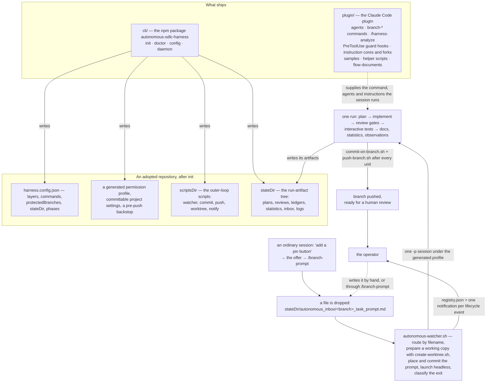

# autonomous-sdlc-harness

An autonomous software-delivery harness: ask for a change in an ordinary Claude Code session and it offers to run it — prompt in, and a headless multi-agent run plans it, implements it unit by unit, puts the result through independent review gates, and ends at a pushed branch ready for a human review: branch out. Under that, one task prompt dropped into a watched directory is the same doorway, for scripts and for anyone who prefers it. It ships as two halves — a Claude Code plugin carrying the process assets, and a Node CLI carrying the outer loop that runs them.



**The plugin carries the process assets a run executes** — the instruction cores and their thin forks, the agent definitions, the `branch-*` slash commands and the `/harness-analyze` setup command, the tool-guard hooks declared in `hooks/hooks.json`, the helper scripts those assets invoke, the sample plan and review fixtures their bodies dereference by path, and the two flow documents that describe the loop they run. Every intra-plugin reference is written `${CLAUDE_PLUGIN_ROOT}/…`, the only form that resolves under both a git-sourced install and a directory-sourced one. That inventory is [`plugin/README.md`](plugin/README.md)'s, and why the flow documents travel inside the plugin rather than beside this file is [`plugin/docs/README.md`](plugin/docs/README.md)'s.

**The CLI is the npm package that carries the outer loop** — `init`, `doctor`, `config` and `daemon`. It is a separate package because a plugin cannot write a repository's `settings.json`, and getting that permission profile right is the highest-friction part of adoption. `init` wires an adopting repository in one deterministic pass — the configuration, the wrapper scripts, the run-artifact tree, the conventions stubs, the permission profile, the committable project settings, the repository-root files and the pre-push hook — creating what is absent and keeping what the adopter has edited; `doctor` re-checks a wired repository and reports every finding with its exit status as the contract; `config` reads and updates one dotted configuration key at a time; `daemon` installs, starts and stops this repository's run daemon, and lists the repositories on this machine one has been installed for. The four commands are [`docs/cli.md`](docs/cli.md)'s, and the package's own recorded decisions are [`cli/README.md`](cli/README.md)'s.

**A drop becomes a pushed branch** with no queue server, no webhook and no scheduler in between: one file written into `<state_dir>/autonomous_inbox/` — by hand, or by the offer that turns a conversational change request into that drop — is acted on by the next poll pass. The filename selects the engine command, the working-copy strategy and where the file lands, all three at once. The watcher prepares that working copy through `create-worktree.sh`, commits a dropped task prompt through `commit-on-branch.sh` and pushes it through `push-branch.sh` — a review drop is placed and deliberately not committed — then launches one headless `-p` session of the bound command in that copy under the generated permission profile, classifies the session's exit into `registry.json`, and sends one notification per lifecycle event through `autonomous-notify.sh`. Inside that session the run drives a fleet of single-purpose sub-agents through plan → implement → review gates → interactive tests → statistics, committing and pushing after every unit, ending at "branch ready for review" and never touching a protected branch. The outer loop is [`docs/watcher.md`](docs/watcher.md)'s; what the run does inside it is [`plugin/docs/AUTONOMOUS_FLOW.md`](plugin/docs/AUTONOMOUS_FLOW.md)'s.

## Quick start

**Status: published.** The npm package `autonomous-sdlc-harness` is in the registry — `npm view autonomous-sdlc-harness version` answers with the published version and exits `0` — and the marketplace step A adds is this repository, so steps A, B, D, E and step F's `doctor` line are commands an adopter runs as written. What runs from a clone of this repository, with nothing installed, is the example project immediately below. The two contributor routes into a working copy — the directory-source marketplace add that reaches the plugin, and the built `node cli/dist/cli.js` form that produces the wired repository step C needs — are [`docs/development.md`](docs/development.md) §1 and §5's.

### See it without adopting it

From a clone of this repository, this path runs today, and shows what a finished run leaves behind before you wire anything of your own. A `package-lock.json` is committed beside the project, so the install is `npm ci`; `npm run dev` serves until you stop it.

```bash
cd examples/notes-app
npm ci
npm run typecheck
npm test
npm run dev
```

`examples/notes-app/` is a dull TypeScript notes application — a `localStorage` gateway, a domain layer over it, a DOM surface over that — that the harness was adopted into, and its `sdlc-harness/` directory holds the artifacts of one **real** end-to-end run over it, the branch `feat_note_updated_at`: its task prompt, its story index and per-task plans, its interactive-test plan and the seven per-test files under it, its code review and per-finding files, the three failing meta-review rounds that review took to converge, its flow-progress ledger, its dispatch-additions record, its improvement-observations intake and its statistics report. What "end-to-end" covers there is fixed by that project's own phase configuration, and is stated once under [Scope and limits](#scope-and-limits). Read [`examples/notes-app/README.md`](examples/notes-app/README.md) first — it carries the decisions and disclosures the directory's own files do not state.

The last three commands above are the lines the harness's generated wrapper scripts wrap, run directly. That directory carries no `.git` of its own, so those wrappers — and the CLI's own checks on a wired repository — resolve to the repository that **contains** it rather than to it; [`examples/notes-app/README.md`](examples/notes-app/README.md) states that in full.

### Adopting it in your own repository

**A. Install the harness — once per machine.** Adds this repository as a plugin marketplace, then installs the single plugin it publishes, `autonomous-sdlc-harness`.

```bash
claude plugin marketplace add firu-daniel/autonomous-sdlc-harness
claude plugin install autonomous-sdlc-harness@autonomous-sdlc-harness
```

The two lines above are the **published** form of this step, and they resolve against this repository rather than a clone of it: `marketplace add` accepts `<owner>/<repo>`, an `https://…` URL and a `./path`, but not a `file://` one, so a clone is a **contributor's** source rather than a stand-in for the published repository. Adding the marketplace as `./` from a clone installs the same plugin from a snapshot copy of that clone rather than from the published repository — [`docs/development.md`](docs/development.md) §1 is the decision of record and carries the refresh loop that snapshot needs, and it is the route a contributor changing the **plugin** works through — step C additionally needs a repository wired by §5 gate 8's `node cli/dist/cli.js init --cwd <scratch-analyze>`, after that section's gate 2 build.

**B. Wire a project — once per repo.** One deterministic pass with no model call in it: the configuration, the run-artifact tree, the outer-loop wrapper scripts, the conventions skeletons, the permission profile, the committable project settings, the repository-root files and the pre-push hook — creating what is absent and keeping what you have edited. Each of those is [`docs/cli.md`](docs/cli.md) §2's.

```bash
npx autonomous-sdlc-harness init
```

**C. Teach it the codebase — once per repo, LLM-assisted.** In an interactive Claude Code session opened on the wired repository, with the plugin installed — from the marketplace in step A, or from a clone as a directory source (see the note under step A) — type either form. It fills the conventions documents from the repository's real code and *proposes* a layer-profile revision; it never writes `harness.config.json` itself.

```
/harness-analyze              # all targets
/harness-analyze presentation # or one target at a time
```

This step is interactive-only, and it needs write access to the repository's own `.claude/` tree. Both are measured limits, and both are stated once under [Scope and limits](#scope-and-limits). What the command may write is [`docs/analyze.md`](docs/analyze.md) §3; how the offer to run it reaches that first session is §9 of the same document.

**D. Verify.** Reports everything wrong with a wired repository rather than the first thing, with the exit status as the contract: `0` when no check failed, `1` when at least one did. The checks are enumerated in [`docs/cli.md`](docs/cli.md) §7.

```bash
npx autonomous-sdlc-harness doctor
```

**E. Run.** Installs this repository's own run daemon into the host's service manager and starts it. On launchd the lifecycle is driven for you; on systemd the unit is written and the `systemctl --user` commands are printed for you to run ([`docs/cli.md`](docs/cli.md) §9).

```bash
npx autonomous-sdlc-harness daemon install
npx autonomous-sdlc-harness daemon start
```

Then just ask for the change: an ordinary interactive session in this repository, asked for a change to the project's code, offers to run it autonomously and on that answer invokes `/branch-prompt` itself with the request as its argument — defined by the pair `init` writes: the fence and its trigger in the `## Where a change request runs` section of `.claude/CLAUDE.md` ([`cli/templates/claude/CLAUDE.md`](cli/templates/claude/CLAUDE.md)), and the dialogue itself in `.claude/harness-task-offer.md` ([`cli/templates/claude/harness-task-offer.md`](cli/templates/claude/harness-task-offer.md)). The direct routes reach the same drop: `/branch-prompt` for an adopter who already knows they want a run, and a file written by hand into `<state_dir>/autonomous_inbox/` — `<state_dir>` defaults to `sdlc-harness/` ([`docs/config.md`](docs/config.md) §3) — named `<branch>_task_prompt.md`. The next poll pass acts on it, and what it does then is [`docs/watcher.md`](docs/watcher.md) §1's.

**F. A teammate clones.** `git clone` → open the repository in Claude Code → **accept the workspace trust dialog** → the plugin resolves from the two keys `init` committed into `.claude/settings.json`, with `/reload-plugins` for a session that was already open → `npx autonomous-sdlc-harness doctor`. `enabledPlugins` is written on every run; `extraKnownMarketplaces` — the half that tells a clone where the plugin comes from — wherever the owner slug resolves, from this package's own `repository.url` or from `--marketplace <owner>/<repo>`; where neither route resolves an owner, `init` writes `enabledPlugins` alone ([`docs/cli.md`](docs/cli.md) §2). No `init` re-run: `harness.config.json` and the permission profile are committed.

## How it is measured

**An eval harness with online success metrics.** Every branch is scored against the plan that run committed to. The denominator is the sum of the story-point estimates its own story index carries, so the scope a run is graded on is weighted by complexity rather than counted as tasks; the subtraction is the severity-weighted cost of the observations a hands-on human review raised against the finished branch. One report per branch lands in the run-artifact tree beside the work, at `<state_dir>/branch_statistics/<branch>/statistics.md`, written by [`plugin/agents/statistics-plan-writer.md`](plugin/agents/statistics-plan-writer.md) in the run's closing phase ([`plugin/docs/AUTONOMOUS_FLOW.md`](plugin/docs/AUTONOMOUS_FLOW.md) → `## Statistics`). The formula, the severity weights and the edge-case rules are [`plugin/samples/sample_statistics.md`](plugin/samples/sample_statistics.md)'s — the format of record, not restated here.

**A headline `100%` means "not reviewed yet".** The report is written twice over a branch's life, and its `status:` line says which write you are reading: `pre-user-review` lands at the end of the delivery run, when no human has looked at the branch and there is nothing yet to subtract, so it reads `100%` by construction; `post-user-review` lands after a fix round, recounted from scratch and overwriting the first. The second number is the real one. That lifecycle — one file per branch, overwritten rather than round-suffixed — is [`cli/templates/state-dir/branch_statistics/README.md`](cli/templates/state-dir/branch_statistics/README.md)'s.

**"Eval" means two things here:** [`evals/`](evals/README.md) is an **offline** capability measurement of the harness itself, taken over a fixture rather than over delivered work: two arms over a scaffolded fixture — a plugin arm and a no-plugin baseline arm — get the same prompt, and the grader reads whether the harness's plan shape appears at all. The statistics above are **online**: one success rate per branch, computed from work the harness actually delivered, in the units that branch planned in ([`plugin/samples/sample_statistics.md`](plugin/samples/sample_statistics.md)). What the eval corpus covers today is one case, and its limit is stated under [Scope and limits](#scope-and-limits).

**It is not a scoreboard, and it is not precise.** The tree deliberately holds no cross-branch roll-up, so an absent report means a run never reached its closing phase rather than a branch that scored nothing ([`cli/templates/state-dir/branch_statistics/README.md`](cli/templates/state-dir/branch_statistics/README.md)). And the rate is a deliberately basic estimate, refined-later by design — which is why each raw count it was derived from is retained beside it rather than discarded ([`plugin/samples/sample_statistics.md`](plugin/samples/sample_statistics.md) → `## Notes`).

## Two ledgers

**The lessons ledger is how a review escape becomes a rule.** A defect that got past every automated gate on a branch and was caught only by a human's hands-on review of the finished work is distilled to one line and filed in [`cli/templates/state-dir/lessons.md`](cli/templates/state-dir/lessons.md). Its **only** writer is the agent that turns a hands-on review into a fix plan, appending once per review round; its readers are every agent that plans work or grades it, **before it starts** — before a plan is drafted, before a review is graded. An entry carries the same force as a rule in one of the project's own conventions documents, so a plan that re-plans a lesson fails its review. It is appended to and never rewritten, which is what makes it the whole history of a project's review escapes rather than a current-state file; the append rules are stated in the ledger's own header and are not restated here. It lives in the run-artifact tree rather than beside the agent configuration so that an unattended headless run can append to it.

**The improvement ledger is how the harness's own defects get counted, and no agent reads it.** A run records the harness and workflow problems it actually hit — a gated command, a phase that skipped silently, work regenerated after a resume — in exactly one intake file per branch at `<state_dir>/improvement_observations/<branch>.md`, written once at the end of the run ([`plugin/docs/AUTONOMOUS_FLOW.md`](plugin/docs/AUTONOMOUS_FLOW.md) → `## Improvement observations`), and a human folds those intakes into [`cli/templates/state-dir/improvement_suggestions.md`](cli/templates/state-dir/improvement_suggestions.md). **No agent reads that ledger** — these are maintenance items with no value to an agent implementing a change, so it is on no agent's reading list. One intake file per branch is the design and not an accident: a single shared append target across parallel runs is a reliable generator of merge conflicts ([`cli/templates/state-dir/improvement_observations/README.md`](cli/templates/state-dir/improvement_observations/README.md)). A real intake, left behind by the captured run over the example project, is [`examples/notes-app/sdlc-harness/improvement_observations/feat_note_updated_at.md`](examples/notes-app/sdlc-harness/improvement_observations/feat_note_updated_at.md). The category vocabulary an entry carries is defined once, in [`plugin/instructions/improvement_observations_instructions.md`](plugin/instructions/improvement_observations_instructions.md) → `## The entry format`, and is re-glossed neither in the ledger nor here.

**Why both.** The two ledgers close different loops. The lessons ledger improves the **work product**: it feeds back into the rules that bind the next plan and the next review, so a class of defect that escaped once is refused the second time. The improvement ledger improves the **process**: the harness's own gaps, which no agent can be trusted to prioritise, and which a human triages across runs precisely because frequency is the diagnosis. A system with only the first would keep tripping over its own tooling; one with only the second would keep shipping the same review escape.

**Neither ledger is a live file this repository keeps.** Both are templates `init` writes into an adopter's repository under the configured `<state_dir>`, and are that repository's from there on — a re-run never touches a ledger that already exists. The example project shows both halves of that: [`examples/notes-app/README.md`](examples/notes-app/README.md) records `improvement_suggestions.md` among the omitted family, and records the untouched `sdlc-harness/lessons.md` as the first of that omission rule's two exceptions — carried byte for byte from the template and never appended to by the captured run, so that the fixture's always-loaded `.claude/CLAUDE.md` link to it resolves.

## Scope and limits

What this harness does not do, and what has not been measured. The first group is the shape of the system as designed; the second bounds the evidence this repository ships; the third was measured while producing that evidence and is described here rather than fixed — this release changes none of it.

### The shape of the system

- **Claude-bound today.** One engine. The process assets ship as a Claude Code plugin, and a run is one headless `claude -p` session driving them. There is no second backend and no abstraction in front of the first, so changing engine today means rewriting the outer loop's launch path rather than setting a value. The engine/provider seam is designed and not built: [`ARCHITECTURE.md`](ARCHITECTURE.md) inventories every site the engine is reached at, states the contract an adapter would have to carry, and gives the reason a second engine stays unbuilt here.
- **Single-machine.** Everything is one host's. A daemon is installed per repository ([`docs/watcher.md`](docs/watcher.md) §3), and the state those daemons agree through is machine-local, in a directory outside every repository: a published usage assessment every watcher writes and reads, on by default, plus an opt-in advisory lock, off by default, that serializes which repository runs when an operator turns it on ([`docs/watcher.md`](docs/watcher.md) §5), plus a separate machine-local file recording which repositories have a daemon installed at all ([`docs/watcher.md`](docs/watcher.md) §7). Nothing spans two hosts — no shared queue, no scheduler, no remote executor — so two machines on one account each spend that account's rate-limit window as though they were its only consumer, which within a machine is what the published record stops. None of it bounds burn rate: the per-repository cap, the model and the effort level are the adopter's call, they multiply, and several concurrent high-effort runs will exhaust a rate-limit window that one would not ([`docs/watcher.md`](docs/watcher.md) §4).
- **git only.** No SVN, no Mercurial. git is a hard gate rather than something the CLI works around: `init` refuses to run outside a repository, offering to create one, because the root every write is confined to cannot otherwise be resolved and the worktree-based flow it wires cannot prepare a checkout without one ([`docs/cli.md`](docs/cli.md) §2). A `jj` repository adopts either way, colocated or not: on **jj 0.44** both shapes keep a real non-bare `.git` at the working-copy root, so the CLI distinguishes them nowhere and refuses neither — an older jj kept the store inside `.jj/`, which is where the discriminator this sentence used to rest on would have held, and is why the version is part of the claim rather than a footnote to it. What differs is only that a colocated repository has jj export its refs and `HEAD` to git on every command while a non-colocated one does not, so git sees an unborn `HEAD` and an untracked working copy until something writes to it. The two costs a jj adopter does pay are stated in full where each is enforced: `<githooksDir>/pre-push` is a git hook and `jj git push` performs no git push, so the committed guard covers `git push` and the caller it does not reach is a person at a terminal — the plugin's session-level protected-branch guard does see `jj git push` and draws the identical decision on one that **names** a protected target, while a `jj git push` naming no bookmark carries no target for that arm and cannot trip the guard's HEAD-on-a-protected-branch arm either, since jj keeps `HEAD` detached, so that form is refused by neither layer and a forge-side branch ruleset is its only cover (`doctor`'s `jj-repository` line carries the detail) — and, **on a colocated repository alone**, `defaultBranch` detection loses a rung, because there jj exports `HEAD` to git and points it at a raw commit id after every `jj new`, which a non-colocated repository does not do. `doctor` is the standing reporter of both, on any repository carrying a `.jj/` beside `.git` — which, per the measurement below, is both shapes and not only the colocated one, so its report says that much and no more, and it is the rung clause that carries the colocated qualifier ([`docs/cli.md`](docs/cli.md) §7's `jj-repository` row).
- **Forge-agnostic, which means the last step is yours.** The flow ends at a pushed branch: opening the pull request, requesting the review and merging are not automated. `push-branch.sh`'s whole contract is one row of [`docs/watcher.md`](docs/watcher.md) §2 — "Pushes the current non-protected branch, and never aborts its caller" — and it opens no pull request and consults no platform. A `forge` key (`"github"`, `"gitlab"`, `"none"`) is declared in the configuration with no default, and **nothing reads it in this release** ([`docs/config.md`](docs/config.md) §5); its reader is the forge coupling — an issue-label trigger, draft-pull-request output, comment-based park-and-ask — which is not built, so an absent value reads as a decision not yet made rather than as a silently assumed platform, and nothing reports it: the configuration check speaks only when the key is *present* and is not one of the three.
- **Design→code generation is out of scope.** Nothing in this release turns a design file into code. The flow takes a task prompt and a repository, and no phase reads a design file, so a design change reaches the code the way any other requirement does — as text someone writes into a prompt. A `design.source` key (`"figma"`, `"penpot"`, `"none"`) is declared in the configuration with no default, and **nothing reads it in this release** ([`docs/config.md`](docs/config.md) §5); its reader is the design-source coupling — an adapter reading design tokens and frame/node structure into the flow's inputs — which is not built, so an absent value reads as a decision not yet made rather than as a silently assumed tool, and nothing reports it. [`ARCHITECTURE.md`](ARCHITECTURE.md) `## 8. Declaring a seam before building it` states what that interface is and is not — a design token standard plus a frame/node abstraction, not a vendor's MCP server.

### What the shipped evidence covers, and what it does not

- **The captured example run does not exercise every phase.** [`examples/notes-app/`](examples/notes-app/README.md) sets `phases.parity` and `phases.docs` to `false` in its own [`harness.config.json`](examples/notes-app/harness.config.json), so "one real end-to-end run" there means end to end **over the phases that project's configuration turns on**: the capture demonstrates neither the parity reviewer nor the docs phase. That fixture is not a port of a second implementation and carries no docs catalogue, so there was nothing for either phase to do — but it also means neither has a captured run behind it here.
- **Nothing has been measured with the eval corpus yet.** [`evals/`](evals/README.md) holds **one** case, `plan-shape/`, and that case's own header marks it PROVISIONAL: the runner is gated behind early access, so its `case.yaml` envelope is a guess read off `--help` output. The durable half is settled and runner-independent — the prompt each arm is handed, the scaffold it runs over, and the grader's rubric — but no arm has been run, so this repository publishes no eval result.
- **Parts of the outer loop ship unexercised, and the tree says which.** [`docs/outer-loop-verification.md`](docs/outer-loop-verification.md) records what the watcher, the git wrappers, the worktree scripts and the notifier do when driven against fixtures — each row an observed outcome together with the perturbation that moves it — and publishes, row by row, which paths ship undriven because driving them needs a real service manager, a real headless session or a real rate-limit window. [`docs/guard-verification.md`](docs/guard-verification.md) does the same for the composed `PreToolUse` guard set and its per-call cost. The rows are in those two files.

### Measured while building that evidence, and not fixed here

- **Every documented `/autonomous-sdlc-harness:…` slash spelling is interactive-only.** Measured on Claude Code 2.1.237: in a `claude -p` session both `/autonomous-sdlc-harness:harness-analyze` and the bare `/harness-analyze` answer `Unknown command`, because a plugin's entries register as *skills* — `claude plugin details autonomous-sdlc-harness@autonomous-sdlc-harness` reports them as **Skills (20)** — while asking for the skill **by name** works first time. **The three command strings above are written in the current slug, and the `claude -p` leg has not been re-run since the rename** — that leg was measured under the former slug `harness`, and what it establishes is slug-independent: a first message meets no picker, so the bare spelling fails, and a plugin's entries register as skills. Two of its neighbours have since been run under the current slug, on Claude Code 2.1.263, and neither disturbs it. `claude plugin details autonomous-sdlc-harness@autonomous-sdlc-harness` runs and exits 0 with the plugin installed under the current slug, reporting **Skills (20)** with `harness-analyze` among them — the skills-registration half, reproduced. And in an **interactive** session `/autonomous-sdlc-harness:harness-analyze` resolves in the `/` picker and runs, while the bare `harness-analyze` has no picker entry of its own and is instead fuzzy-matched onto the prefixed one for selection; that is the picker path rather than the first-message path the `Unknown command` result is about. [`docs/development.md`](docs/development.md) §6 states the same boundary from the other side: a command passed as a session's **first message** meets no picker, is matched exactly, and fails with `Unknown command`. Step C of the quick start above is therefore interactive by construction, as it says; typed into a headless session it gets a refusal and no explanation.
- **Any write under a repository's own `.claude/` tree is a supervised action, and no permission entry moves that wall.** The refusal is the tool layer's own treatment of `.claude/**` as a sensitive path, evaluated **ahead of** the permission profile's allow entries: an unattended run's `--permission-mode acceptEdits` does not cover it, and **no `permissions.allow` entry can grant it**, so any fix premised on generating or hand-adding one is wrong before it starts. A first `/harness-analyze` needs write access to the repository's own `.claude/` tree, because that is where the conventions documents it fills live — it is bounded by the wall rather than owning it. Measured on the same version: an unattended run completed with **exit 0 having written nothing**, reporting its own targets as blocked, while the identical invocation under a permissions bypass wrote all five documents. Silent success is the shape to expect, so run step C interactively and check that the conventions documents actually changed. The **second** consequence the wall used to have is closed in this release and is not part of this group: an unattended run's planner could schedule a task whose targets are conventions documents, and such a task parks the run rather than failing it. Both ends of that are now shut. The corpus is rules-only — a line belongs in a conventions document only if adding correct new code cannot make it false, so growing the code does not falsify one ([`plugin/agents/conventions-writer.md`](plugin/agents/conventions-writer.md)). And the planner never plans such a task at all: it raises an invalidated rule into the branch's improvement-observations intake and the run's closing Done summary instead of scheduling it ([`plugin/agents/task-plan-writer.md`](plugin/agents/task-plan-writer.md), `## Corpus staleness`). The entry stays in this section because what those changes remove is an unattended run's exposure to the wall, not the wall: step C is still a supervised step, and it still fails silently when it is not one.
- **A remote is a precondition for a run to *start*, and a run started in place without one reports success while nothing reaches a remote.** Which of the two you get turns on whether the outer loop created the working copy. A drop into the inbox never becomes a run at all: `create-worktree.sh` fetches `origin/<defaultBranch>` and adds the worktree **from that ref** under `set -e`, so with no `origin` — or with one carrying no `origin/<defaultBranch>` — the script refuses before a working copy exists, naming the missing thing, the command that closes it and `doctor`; the watcher then archives the drop as `failed_<timestamp>_<name>` and notifies exactly as it did before, and no session, no phase and no committer ever runs. A run started **in place** — in the adopted repository itself, which calls no worktree script — reaches the end instead: `push-branch.sh` is non-fatal by contract ([`docs/watcher.md`](docs/watcher.md) §2), so every push fails, every committer returns `pushed: failed`, and the flow still completes and reports the branch done with every commit sitting locally. That is what happened in the run captured here, which was started in place in a scratch repository with no remote, whose every commit returned `pushed: failed`, and whose own intake carries an entry saying so ([`examples/notes-app/sdlc-harness/improvement_observations/feat_note_updated_at.md`](examples/notes-app/sdlc-harness/improvement_observations/feat_note_updated_at.md) → *"Every push in the run failed"*); the same non-fatality covers a remote that exists and is unreachable or refuses, in either shape of run. A freshly `init`-ed adoption has no remote by construction, so this is the default state of a first adoption rather than an edge case — and `doctor` now says so before a run rather than after: its `remote` check **fails** a repository with no remote, and one with a remote but no `origin/<defaultBranch>` remote-tracking ref, naming the two commands that close it ([`docs/cli.md`](docs/cli.md) §7). The other end of the same silence is closed too: the run's closing Done summary now states the branch's push state — a branch-delivery line reporting the commit count and whether those commits reached the remote, re-derived from the tree at Phase D — so a run that pushed nothing says so, while the wrapper's non-fatal exit, the committers' `pushed: failed` returns and the flow's completion are all unchanged. The entry stays in this section because what that check, that refusal and that line remove is the silence, not the behaviour above it — and either reading qualifies this file's own opening claim the same way: a run ends at a pushed branch only when there is somewhere to push it.
- **Both `jj` shapes adopt, and the discriminator this README used to draw between them was a fact about an older jj.** Measured on jj 0.44.0: a **non**-colocated repository's `.jj/repo/store/git_target` holds `../../../.git` and `.jj/repo/store/git` does not exist, so a genuine non-bare `.git` sits at the working-copy root of that shape too — `probeRepoRoot()` grades it `repository` exactly as it grades a colocated one, and nothing in the CLI has a basis on which to refuse it. `init` on the non-colocated fixture exited 0 (`48 created, 28 ensured`), took the ordinary unborn-`HEAD` first-commit path with no refusal and no warning, and `doctor` afterwards graded `18 pass, 4 warn, 0 fail` — byte-identical to the grade both colocated fixtures received. Older jj kept the store at `.jj/repo/store/git`, where "a git repository is still there underneath it" would have separated the two shapes; on 0.44 it separates nothing, which is why the bullet above carries the version inside its claim. Two further measurements, on one repository and one hook seconds apart: `git push` fired an instrumented hook and `jj git push` did not run it at all, while the ref landed either way; and `jj git push -b <protected>` put in front of the plugin's session-level `PreToolUse` protected-branch guard drew the identical refusal `git push origin <protected>` draws. What this release **does** change is the two claims that were false rather than anything measured here: [`cli/src/generators/githooks.ts`](cli/src/generators/githooks.ts)'s header now bounds the committed hook's caller-agnostic claim at where git ends, and `doctor`'s new `jj-repository` check states the hook gap, the session guard that covers a `jj git push` naming a protected target, the argument-less form neither layer refuses, and the lost detection rung a **colocated** repository pays — to any repository carrying a `.jj/` beside `.git`, which is the population its probe reaches and, by the measurement above, both shapes: the check therefore reports what it read (`jj` manages this working copy) and puts the colocated qualifier on the rung clause alone ([`docs/cli.md`](docs/cli.md) §7). There is no jj-side hook to install, so nothing here repairs the gap, and every figure above was taken on one pair of fixtures on one jj version, which a later jj can move. The entry stays in this section because what those changes remove is the silence about the two costs, not the costs — and not the measurement above them: both shapes still adopt, and nothing in the CLI tells them apart.

## Where to read more

- [`docs/watcher.md`](docs/watcher.md) — the outer loop: what turns a dropped file into an unattended run, which script does what, the daemon's lifecycle, and the machine-level usage lane.
- [`docs/analyze.md`](docs/analyze.md) — `/harness-analyze`'s decisions of record: what it fills in from an adopted repository's real code, what it refuses to guess, and how the offer to run it reaches a session.
- [`docs/cli.md`](docs/cli.md) — the four subcommands, their flags and exit codes, the `init` re-run contract, the stack-detection table, and the failure modes the generated permission profile encodes.
- [`docs/config.md`](docs/config.md) — one row per configuration value and parameterization token, saying where each one's value comes from.
- [`docs/development.md`](docs/development.md) — changing a file in this repository: running the plugin from a working copy, what that forces on references between assets, and which commands decide whether a change is good.
- [`docs/outer-loop-verification.md`](docs/outer-loop-verification.md) — what the outer-loop scripts do when driven, as rows a later change re-runs rather than re-argues, and which paths ship unexercised.
- [`docs/guard-verification.md`](docs/guard-verification.md) — the composed `PreToolUse` guard set's standing decision matrices and its per-call cost.
- [`docs/typecheck-key-decision.md`](docs/typecheck-key-decision.md) — whether `commands.typecheck` stays a required configuration key: three options assessed on the same five dimensions, with option (b), the explicit `none` sentinel, ratified and implemented.
- [`plugin/docs/AUTONOMOUS_FLOW.md`](plugin/docs/AUTONOMOUS_FLOW.md) — the canonical statement of the inner loop: the phases a run walks, the artifacts it writes, and what it promises when it stops. [`plugin/docs/AUTONOMOUS_FLOW_WHITEBOARD.md`](plugin/docs/AUTONOMOUS_FLOW_WHITEBOARD.md) is its narrative companion, owning no contract of its own.
- [`schemas/README.md`](schemas/README.md) — the JSON Schema for `harness.config.json`, and the boundary between what belongs in that committed file and what belongs in machine-local configuration.
- [`evals/README.md`](evals/README.md) — the evaluation corpus, with one case written and its runner still unverified.
- [`examples/notes-app/README.md`](examples/notes-app/README.md) — the minimal project the harness was adopted into, carrying the artifacts of one real end-to-end run over it.
- [`ARCHITECTURE.md`](ARCHITECTURE.md) — the engine axis: which runtime and which model as two axes, where the engine is reached, the contract an adapter would have to satisfy, and the open-weight backend path with MCP's place in it — designed, and implemented nowhere in this release.
- [`LICENSE`](LICENSE) — Apache-2.0, the stock upstream text; its appendix is the template an adopter copies into their own files, so it stays unfilled. [`NOTICE`](NOTICE) carries the copyright assertion the licence body has no slot for — Copyright 2026 Firu Daniel — and `cli/` ships its own copy of both, because it publishes as a package.

Roadmap item numbers cited throughout this tree are listed in [`docs/development.md`](docs/development.md), under "The roadmap this tree defers to".
