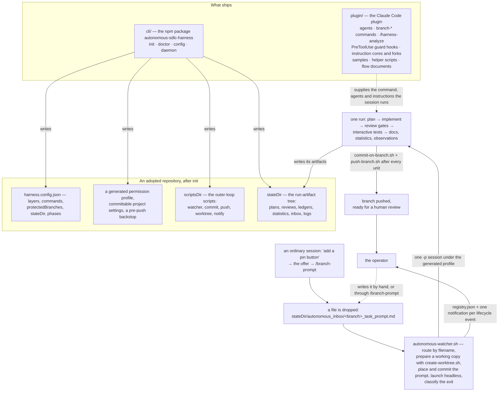

# autonomous-sdlc-harness

An autonomous software-delivery harness for Claude Code.
You ask for a change, and you get back a branch that has been planned, implemented and independently reviewed, pushed and ready for your review.
You install two things: a Claude Code plugin and a Node CLI.

1. Install the plugin: `claude plugin marketplace add firu-daniel/autonomous-sdlc-harness`, then `claude plugin install autonomous-sdlc-harness@autonomous-sdlc-harness` (step A).
2. Wire your repository: `npx autonomous-sdlc-harness init` (step B).
3. Teach it the codebase: type `/harness-analyze` in an **interactive** Claude Code session opened on the repository, not in the terminal (step C).
4. Verify: `npx autonomous-sdlc-harness doctor` (step D).
5. Start the daemon: `npx autonomous-sdlc-harness daemon install`, then `npx autonomous-sdlc-harness daemon start` (step E).

**Before you run it:**

- **Published.** The npm package and the plugin marketplace are both live, so the checklist runs as written. `npm view autonomous-sdlc-harness version` answers with the published version and exits `0`.
- **Contributors.** From a clone, the plugin installs as a directory source, and the built CLI is `node cli/dist/cli.js`. Both routes, and the scratch repository step 3 then needs, are [`docs/development.md`](docs/development.md) §1 and §5.
- **Interactive only.** Step 3 answers `Unknown command` in a headless `claude -p` session. The measurement is [`docs/development.md`](docs/development.md) §6.
- **The `.claude/` write wall.** Step 3 writes under `.claude/`, which no permission entry opens to an unattended run. There it exits `0` having written nothing, so run it supervised and check that the conventions documents changed. See [`docs/analyze.md`](docs/analyze.md) §3.



**The plugin carries the process assets a run executes.** These are the instruction cores and their thin forks, the agent definitions, the `branch-*` slash commands, the `/harness-analyze` setup command, the guard hooks, the helper scripts and the sample fixtures. It also carries the two flow documents that describe the loop they run.

Every reference inside the plugin is written `${CLAUDE_PLUGIN_ROOT}/…`. It is the only form that resolves under both a git-sourced install and a directory-sourced one.

The inventory is [`plugin/README.md`](plugin/README.md). Why the flow documents travel inside the plugin is [`plugin/docs/README.md`](plugin/docs/README.md).

**The CLI is the npm package that carries the outer loop:** `init`, `doctor`, `config` and `daemon`.

It is a separate package because a plugin cannot write a repository's `settings.json`. Getting that permission profile right is the hardest part of adoption.

`init` wires a repository in one deterministic pass. `doctor` re-checks it. `config` reads and updates one configuration key at a time. `daemon` installs, starts and stops the run daemon, and lists the repositories on this machine that have one.

The four commands are [`docs/cli.md`](docs/cli.md). The package's own recorded decisions are [`cli/README.md`](cli/README.md).

**A drop becomes a pushed branch** with no queue server, webhook or scheduler in between. One file lands in `<state_dir>/autonomous_inbox/`, written by hand or by the conversational offer, and the next poll pass acts on it.

The filename picks the engine command, the working-copy strategy and where the file lands. The watcher prepares the working copy, launches one headless `-p` session in it under the generated permission profile, records the exit in `registry.json` and sends one notification per lifecycle event.

Inside that session, single-purpose sub-agents plan, implement, review, test and report. The run commits and pushes after every unit, ends at a branch ready for review, and never touches a protected branch.

The outer loop is [`docs/watcher.md`](docs/watcher.md). What the run does inside it is [`plugin/docs/AUTONOMOUS_FLOW.md`](plugin/docs/AUTONOMOUS_FLOW.md).

## Quick start

### See it without adopting it

This path runs from a clone today, with nothing installed. It shows what a finished run leaves behind. A `package-lock.json` is committed beside the project, so the install is `npm ci`. `npm run dev` serves until you stop it.

```bash
cd examples/notes-app
npm ci
npm run typecheck
npm test
npm run dev
```

`examples/notes-app/` is a small TypeScript notes application the harness was adopted into. Its `sdlc-harness/` directory holds the artifacts of one **real** end-to-end run over it, the branch `feat_note_updated_at`. They are its task prompt, its story index and per-task plans, its interactive-test plan and the seven per-test files under it, its code review and per-finding files, and the three failing meta-review rounds that review took to converge. They also include its flow-progress ledger, its dispatch-additions record, its improvement-observations intake and its statistics report.

What "end-to-end" covers there is set by that project's phase configuration, stated under [Scope and limits](#scope-and-limits). Read [`examples/notes-app/README.md`](examples/notes-app/README.md) first. It carries the decisions and disclosures the directory's own files do not.

The last three commands are the ones the generated wrapper scripts wrap. That directory has no `.git` of its own, so the wrappers and the CLI's checks resolve to the repository that contains it.

### Adopting it in your own repository

**A. Install the harness — once per machine (checklist step 1).** Adds this repository as a plugin marketplace, then installs the one plugin it publishes, `autonomous-sdlc-harness`. Working from a clone instead: see **Contributors** under **Before you run it**.

**B. Wire a project — once per repo (checklist step 2).** One deterministic pass with no model call in it. It creates what is absent and keeps what you have edited. What it writes is [`docs/cli.md`](docs/cli.md) §2.

**C. Teach it the codebase — once per repo, LLM-assisted (checklist step 3).** It fills the conventions documents from the repository's real code. It *proposes* a layer-profile revision and never writes `harness.config.json` itself. To run one target at a time, type `/harness-analyze <target>`.

This step is limited twice: see **Interactive only** and **The `.claude/` write wall** under **Before you run it**. How the offer to run it reaches a first session is [`docs/analyze.md`](docs/analyze.md) §9.

**D. Verify (checklist step 4).** Reports everything wrong with a wired repository, not just the first thing. The exit status is the contract: `0` when no check failed, `1` when at least one did. The checks are [`docs/cli.md`](docs/cli.md) §7.

**E. Run (checklist step 5).** Installs this repository's own run daemon into the host's service manager and starts it. On launchd the lifecycle is driven for you. On systemd the unit is written and the `systemctl --user` commands are printed for you to run ([`docs/cli.md`](docs/cli.md) §9).

Then just ask for the change. An ordinary interactive session in this repository offers to run a change request autonomously, and on a yes it invokes `/branch-prompt` with the request. The offer is defined by two files `init` writes: [`cli/templates/claude/CLAUDE.md`](cli/templates/claude/CLAUDE.md) and [`cli/templates/claude/harness-task-offer.md`](cli/templates/claude/harness-task-offer.md).

Two direct routes reach the same drop: `/branch-prompt` itself, or a file named `<branch>_task_prompt.md` written into `<state_dir>/autonomous_inbox/` ([`docs/config.md`](docs/config.md) §3). The next poll pass acts on it, as [`docs/watcher.md`](docs/watcher.md) §1 describes.

**F. A teammate clones.** `git clone` → open the repository in Claude Code → **accept the workspace trust dialog** → the plugin resolves from the keys `init` committed into `.claude/settings.json`, with `/reload-plugins` for a session that was already open → `npx autonomous-sdlc-harness doctor`. Which keys are written is [`docs/cli.md`](docs/cli.md) §2. No `init` re-run is needed: `harness.config.json` and the permission profile are committed.

## How it is measured

**Every branch is scored against its own plan.** The denominator is the sum of the story points in that branch's own story index, so scope is weighted by complexity rather than counted as tasks. The subtraction is the severity-weighted cost of what a hands-on human review found in the finished branch.

One report per branch lands at `<state_dir>/branch_statistics/<branch>/statistics.md`. [`plugin/agents/statistics-plan-writer.md`](plugin/agents/statistics-plan-writer.md) writes it in the run's closing phase ([`plugin/docs/AUTONOMOUS_FLOW.md`](plugin/docs/AUTONOMOUS_FLOW.md) → `## Statistics`). The formula, the severity weights and the edge-case rules are in [`plugin/samples/sample_statistics.md`](plugin/samples/sample_statistics.md).

**A headline `100%` means "not reviewed yet".** The report is written twice, and its `status:` line says which write you are reading. `pre-user-review` lands at the end of the delivery run, before any review, so it reads `100%`. `post-user-review` lands after a fix round and overwrites the first. The second number is the real one ([`cli/templates/state-dir/branch_statistics/README.md`](cli/templates/state-dir/branch_statistics/README.md)).

**"Eval" means two things here.** [`evals/`](evals/README.md) is an **offline** measurement of the harness itself: a plugin arm and a no-plugin baseline arm get the same prompt over a fixture. The statistics above are **online**: one success rate per branch, from work the harness actually delivered ([`plugin/samples/sample_statistics.md`](plugin/samples/sample_statistics.md)). The eval corpus holds one case today, and its limit is under [Scope and limits](#scope-and-limits).

**It is not a scoreboard, and it is not precise.** There is no cross-branch roll-up, so a missing report means the run never reached its closing phase ([`cli/templates/state-dir/branch_statistics/README.md`](cli/templates/state-dir/branch_statistics/README.md)). The rate is a basic estimate, and the raw counts are kept beside it so it can be refined later ([`plugin/samples/sample_statistics.md`](plugin/samples/sample_statistics.md) → `## Notes`).

## Two ledgers

**The lessons ledger turns a review escape into a rule.** A defect that only a human's hands-on review caught becomes one line in [`cli/templates/state-dir/lessons.md`](cli/templates/state-dir/lessons.md). The agent that turns a review into a fix plan is its only writer. Every agent that plans or grades work reads it before it starts, and an entry binds like a conventions rule. The append rules are in the ledger's own header.

**The improvement ledger counts the harness's own defects, and no agent reads it.** A run records the harness and workflow problems it hit in one intake file per branch, `<state_dir>/improvement_observations/<branch>.md` ([`plugin/docs/AUTONOMOUS_FLOW.md`](plugin/docs/AUTONOMOUS_FLOW.md) → `## Improvement observations`). A human folds the intakes into [`cli/templates/state-dir/improvement_suggestions.md`](cli/templates/state-dir/improvement_suggestions.md). Why it is one file per branch is in [`cli/templates/state-dir/improvement_observations/README.md`](cli/templates/state-dir/improvement_observations/README.md), and the entry categories are in [`plugin/instructions/improvement_observations_instructions.md`](plugin/instructions/improvement_observations_instructions.md) → `## The entry format`. A real intake from the captured run is [`examples/notes-app/sdlc-harness/improvement_observations/feat_note_updated_at.md`](examples/notes-app/sdlc-harness/improvement_observations/feat_note_updated_at.md).

**Why both.** The two ledgers close different loops. The lessons ledger improves the **work product**: a class of defect that escaped once is refused the next time. The improvement ledger improves the **process**: the harness's own gaps, which a human triages across runs because frequency is the diagnosis.

**Neither ledger is a live file in this repository.** Both are templates `init` writes under an adopter's `<state_dir>`, and a re-run never touches a ledger that already exists. How the example project carries them is in [`examples/notes-app/README.md`](examples/notes-app/README.md).

## Scope and limits

What this harness does not do, in three groups: the shape of the system as designed, the limits of the evidence this repository ships, and what was measured while producing that evidence. This release changes none of it.

### The shape of the system

- **Claude-bound today.** One engine: the process assets ship as a Claude Code plugin, and a run is one headless `claude -p` session. There is no second backend and no abstraction in front of the first, so changing engine means rewriting the outer loop's launch path. The engine/provider seam is designed and not built: [`ARCHITECTURE.md`](ARCHITECTURE.md) lists every site the engine is reached at, the contract an adapter would carry, and why a second engine stays unbuilt here.
- **Single-machine.** Everything runs on one host, with a daemon per repository ([`docs/watcher.md`](docs/watcher.md) §3). The daemons agree through machine-local state: a published usage assessment, on by default, an opt-in advisory lock ([`docs/watcher.md`](docs/watcher.md) §5), and a record of which repositories have a daemon ([`docs/watcher.md`](docs/watcher.md) §7). Nothing spans two hosts, so two machines on one account each spend its rate-limit window as though alone. Nothing bounds burn rate either: the per-repository cap, the model and the effort level are the adopter's call and they multiply, so several concurrent high-effort runs will exhaust a rate-limit window that one would not ([`docs/watcher.md`](docs/watcher.md) §4).
- **git only.** No SVN, no Mercurial. Outside a repository, `init` offers to create one, and refuses when it cannot ask. A `jj` repository adopts in both shapes. Why git is a hard gate is in [`docs/cli.md`](docs/cli.md) §2. What a `jj` adopter pays is in [`docs/cli.md`](docs/cli.md) §7, the `jj-repository` check.
- **Forge-agnostic, which means the last step is yours.** The flow ends at a pushed branch; opening the pull request, requesting review and merging are not automated. `push-branch.sh` opens no pull request and consults no platform ([`docs/watcher.md`](docs/watcher.md) §2). A `forge` key (`github`, `gitlab` or `none`) is declared, but nothing reads it in this release ([`docs/config.md`](docs/config.md) §5). The configuration check speaks only when the key is present and holds none of those three.
- **Design→code generation is out of scope.** Nothing in this release turns a design file into code. No phase reads a design file, so a design change reaches the code as text someone writes into a prompt. A `design.source` key (`figma`, `penpot` or `none`) is declared, but nothing reads it in this release ([`docs/config.md`](docs/config.md) §5). The configuration check speaks only when the key is present and holds none of those three. [`ARCHITECTURE.md`](ARCHITECTURE.md) `## 8. Declaring a seam before building it` states what that interface would be.

### What the shipped evidence covers, and what it does not

- **The captured example run does not exercise every phase.** [`examples/notes-app/`](examples/notes-app/README.md) turns `phases.parity` and `phases.docs` off in its own [`harness.config.json`](examples/notes-app/harness.config.json), because it ports nothing and has no docs catalogue. So the capture shows neither the parity reviewer nor the docs phase.
- **Nothing has been measured with the eval corpus yet.** [`evals/`](evals/README.md) holds one case, `plan-shape/`, marked PROVISIONAL because its runner is gated behind early access. No arm has been run, so this repository publishes no eval result.
- **Parts of the outer loop ship unexercised, and the tree says which.** [`docs/outer-loop-verification.md`](docs/outer-loop-verification.md) records what the outer-loop scripts do when driven against fixtures, and which paths ship undriven because they need a real service manager, headless session or rate-limit window. [`docs/guard-verification.md`](docs/guard-verification.md) does the same for the `PreToolUse` guard set and its per-call cost.

### Measured while building that evidence, and not fixed here

- **Every documented `/autonomous-sdlc-harness:…` slash spelling is interactive-only.** The documented `/…harness-analyze` spellings work only in an interactive session; headless, both answer `Unknown command`. The measurement and its versions are in [`docs/development.md`](docs/development.md) §6, the paragraph opening "A third debt belongs to no row at all".
- **Any write under a repository's own `.claude/` tree is a supervised action.** No permission entry opens it, and an unattended run exits 0 having written nothing. So run step C interactively and check that the conventions documents changed ([`docs/analyze.md`](docs/analyze.md) §3, "What it may write").
- **A remote is a precondition for a run to *start*.** With no remote, a dropped prompt never starts, and a run started in place reports success while nothing is pushed. `doctor`'s `remote` check fails first ([`docs/cli.md`](docs/cli.md) §7, the `remote` check).
- **Both `jj` shapes adopt.** A `jj git push` is not seen by the git pre-push hook. The measurement, its version and what `doctor` reports are in [`docs/cli.md`](docs/cli.md) §7, the `jj-repository` check.

## Where to read more

- [`docs/watcher.md`](docs/watcher.md) — the outer loop: what turns a dropped file into an unattended run, which script does what, the daemon's lifecycle, and the machine-level usage lane.
- [`docs/analyze.md`](docs/analyze.md) — `/harness-analyze`'s decisions of record: what it fills in from real code, what it refuses to guess, and how the offer to run it reaches a session.
- [`docs/cli.md`](docs/cli.md) — the four subcommands, their flags and exit codes, the `init` re-run contract, the stack-detection table, and the failure modes the generated permission profile encodes.
- [`docs/config.md`](docs/config.md) — one row per configuration value and parameterization token, saying where each one's value comes from.
- [`docs/development.md`](docs/development.md) — changing a file in this repository: running the plugin from a working copy, what that forces on references between assets, and which commands decide whether a change is good.
- [`docs/outer-loop-verification.md`](docs/outer-loop-verification.md) — what the outer-loop scripts do when driven, and which paths ship unexercised.
- [`docs/guard-verification.md`](docs/guard-verification.md) — the composed `PreToolUse` guard set's decision matrices and its per-call cost.
- [`docs/typecheck-key-decision.md`](docs/typecheck-key-decision.md) — whether `commands.typecheck` stays a required key, with option (b), the explicit `none` sentinel, ratified and implemented.
- [`plugin/docs/AUTONOMOUS_FLOW.md`](plugin/docs/AUTONOMOUS_FLOW.md) — the canonical statement of the inner loop, with [`plugin/docs/AUTONOMOUS_FLOW_WHITEBOARD.md`](plugin/docs/AUTONOMOUS_FLOW_WHITEBOARD.md) as its narrative companion.
- [`schemas/README.md`](schemas/README.md) — the JSON Schema for `harness.config.json`, and what belongs in that committed file versus machine-local configuration.
- [`evals/README.md`](evals/README.md) — the evaluation corpus, with one case written and its runner still unverified.
- [`examples/notes-app/README.md`](examples/notes-app/README.md) — the minimal project the harness was adopted into, with the artifacts of one real end-to-end run.
- [`ARCHITECTURE.md`](ARCHITECTURE.md) — the engine axis: runtime and model, where the engine is reached, the adapter contract, and the open-weight backend path, designed and not implemented.
- [`ROADMAP.md`](ROADMAP.md) — what is planned beyond this release, one row per feature with a short description and a status.
- [`LICENSE`](LICENSE) — Apache-2.0, the stock text with its appendix left unfilled, with the copyright in [`NOTICE`](NOTICE) and a copy of both shipped in `cli/`.

Roadmap item numbers cited throughout this tree are listed in [`docs/development.md`](docs/development.md), under "The roadmap this tree defers to".
