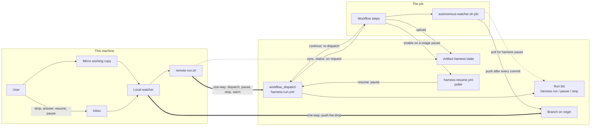

# Remote execution on GitHub Actions

**Who reads this:** a maintainer deciding whether to run the harness's unattended runs in a GitHub Actions job instead of on their own machine, and anyone changing the remote path — the watcher's dispatch, `remote-run.sh`, the two workflow templates. It owns the design of record: what happens between a dropped file and a pushed branch when a run executes remotely, each decision the design took and its reason, and the GitHub behaviours the design rests on without having verified them. Setup, runner choices, credentials, costs and security are §7 onward.

It cites rather than restates. The key's contract is [`config.md`](config.md) → `## 5. Key reference`; the workflows `init` writes, `init --plugin-root-entries` and `doctor`'s `remote-execution` and `remote-github` checks are [`cli.md`](cli.md); the pause/resume protocol is `plugin/instructions/autonomous_pause_and_ledger.md`; the local watcher is [`watcher.md`](watcher.md). The code of record is `cli/templates/scripts/remote-run.sh` (its header states every verb and its exit map), `cli/templates/scripts/autonomous-watcher.sh` → the header's `REMOTE DISPATCH` and `JOB MODE` blocks, the headers of `cli/templates/github/workflows/harness-run.yml` and `harness-resume.yml`, and `cli/templates/scripts/lib/harness-run-lib.sh` → `THE REMOTE STATE BUNDLE`.

---

## Turning it on, in short

Remote execution is off unless `harness.config.json` carries `execution.target` set to `github-actions`. Absent or `local`, nothing in this document happens: `init` writes no workflow, the watcher launches every run on this machine as before, and nothing new is asked of anyone. The switch:

```
npx autonomous-sdlc-harness config set execution.target github-actions
```

With it on, the watcher still runs on this machine — it is what dispatches — and the run itself executes in a job on a GitHub-hosted runner, or on a self-hosted runner when the repository variable `HARNESS_RUNNER` names its runner label. The workflows must then be written, committed and pushed to GitHub's default branch and a credential secret set before the first drop; §7 gives every step, secret and variable, and §8 the runner choices.

---

## 1. The lifecycle of a remote run

From a drop to a pushed branch:

1. **The drop.** The user runs `/autonomous-sdlc-harness:branch-prompt` (or answers `Run it autonomously` to the task offer, which invokes it). The file lands in the main checkout's inbox exactly as it does for a local run.
2. **Preparation.** The watcher's inbox pass reads `execution.target` from the configuration in effect for that drop, then does what it does locally: creates the working copy, copies the artifact in, commits it and pushes the branch. For a remote run a failed commit or push **blocks** the dispatch, because the job sees only what was pushed; locally it never blocks. The usage hold, the concurrency cap and the machine lane are skipped, since the job gates itself. The kill switch `AUTONOMOUS_STOP` still defers the drop.
3. **Dispatch.** The watcher calls `remote-run.sh dispatch <branch> --engine <kind>`, which sends `workflow_dispatch` to `harness-run.yml` with `action: run` and `chain: 0`. The registry record is written with `execution: github-actions` and an empty `pid`; a run keeps the execution it started with for its whole life, and every later pass reads the record's field, never the current key. From here the local working copy is a **mirror** that only `remote-run.sh sync` fills.
4. **The job's setup**, in the order `harness-run.yml` runs it: compute the time budget from `runner.environment`; stop if `HARNESS_REMOTE_STOP` is set; check out the branch; check for `jq` and `gh`; read `scriptsDir` and whether docs retrieval applies from `harness.config.json` at run time; set up Node; install the `claude` CLI when absent; refuse when neither credential secret is set; install the plugin and refuse on a version other than the one the workflow was rendered for; restore the retrieval cache when retrieval applies; generate the job's permission profile with `init --plugin-root-entries` and fail if that changed a tracked file; run `doctor` as a preflight; bootstrap the checkout with `setup-worktree.sh`; and `remote-run.sh restore` the previous job's state bundle.
5. **The run.** `autonomous-watcher.sh job <branch> <engine> <resume>` launches one session through the watcher's own `spawn_engine` and supervises it (§3). It writes `status.json` with decision `continue` before the launch, so a job killed mid-run still leaves a bundle that says *continue*.
6. **The end of the job.** Under `always()`: `push-branch.sh`, then `remote-run.sh save` and the upload of the bundle as the Actions artifact `harness-state`. Under `!cancelled()`: `remote-run.sh continue`. Under `cancelled()`: a best-effort `failed` notification.
7. **The decision.** `continue` reads the bundle's `decision`. `continue` re-dispatches the same workflow with `resume: pause` and `chain` one higher; `wait-poller` enables `harness-resume.yml`; `stop` does nothing, because job mode has already notified.
8. **Done.** A run that completes ends with status `completed`, decision `stop`, a `completed` notification and its branch pushed. No pull request is opened (§5).



The thick arrows are the only edges from this machine to GitHub, and each is a user's action relayed. The dotted arrows are reads. Nothing flows from GitHub to this machine unless the user asks: once the dispatch is sent, the machine can be switched off for the rest of the run.

**What each local command does for a remote run.** Every command that reads a remote record first runs `remote-run.sh sync` on each remote record not already `completed` or `failed`, so it acts on the job's newest state; the exception is `branch-status`, which never syncs.

| Command | What it does for a remote run |
|---|---|
| `/autonomous-sdlc-harness:branch-prompt` | Unchanged: it writes the inbox file, and the watcher is what dispatches it (steps 2–3). |
| `/autonomous-sdlc-harness:branch-user-review` | Writes the review into the inbox. The watcher fast-forwards the working copy to `origin/<branch>` — the job, not this copy, is where the branch advanced — commits the review as `chore: add user review for <branch>`, pushes it and dispatches `engine: user_review`. A local run leaves the review for the flow's own commits; a remote one cannot, because a job boundary before that commit would lose it. |
| `/autonomous-sdlc-harness:branch-answer` | Writes the answer into the mirror. Once every open question of the park has its answer, the watcher dispatches `resume: answer` carrying the answers as one JSON input, and refuses, naming the limit, a payload over GitHub's `workflow_dispatch` limit of 65,535 characters. An answer travels as an input because clarification files are gitignored by design. |
| `/autonomous-sdlc-harness:branch-resume` | Writes `RESUME` into the mirror; the watcher dispatches `resume: pause`. A record synced as `paused` with `pause_reason: killed` — a job that ended mid-run — resumes the same way. |
| `/autonomous-sdlc-harness:branch-pause` | Writes `PAUSE` into the mirror; the watcher relays it as `remote-run.sh pause`, a jobless run titled `harness pause <branch>`. The job finds it by polling and drops its own `PAUSE`, and the run yields at its next clean checkpoint exactly as a local one does (§3). |
| `/autonomous-sdlc-harness:branch-status` | Runs `remote-run.sh status` once — the newest runs with their URLs and the last-synced record — and reads the synced `<branch>.remote.log`. It writes nothing and never syncs. |
| `remote-run.sh stop <branch>` | Stops the run outright (§3, *The kill switch and stopping*). |
| `gh run cancel <run id>` | Cancels one job. Its chain stops, because the re-dispatch step runs only under `!cancelled()`, but a usage-paused run waiting for the poller has no job to cancel and would still be resumed. Use `remote-run.sh stop` to reach both. |

Each relay is a dispatch with `chain: 0` that takes no cap slot and consults no lane. A refusal or a `gh` failure is one log line, the mirror file stays, and the next watcher pass retries. So a relay needs the local watcher running at the moment the user acts, and at no other time.

To stop a run, with the default `scriptsDir` of `scripts`:

```
bash scripts/remote-run.sh stop <branch>
```

---

## 2. Why the job runs the watcher

**The job runs `autonomous-watcher.sh job`, not `anthropics/claude-code-action`.** What the local watcher does for a local run, the job must do for itself, and the watcher is already the thing that does it: the launch line flag for flag (`--settings`, `--permission-mode`, the conditional `--model` and `--effort`, `--output-format stream-json`, the two `--add-dir`), the teed stream the usage gate parses, `classify_run_exit`, the park-loop guard and the stall watchdog. The action wraps its own launch and permission handling and exposes no teed stream to gate on, so each of those would have to be rebuilt around it.

**Job mode runs exactly one run, in the job's own checkout**, where the main checkout and the working copy are the same directory. It is refused unless `HARNESS_JOB_MODE=1`, which only the workflow sets, because the stall watchdog's `git reset --hard HEAD` would act on whatever checkout it ran in. It turns off the inbox pass, the cleanup sweep, the live-log window and both halves of the machine lane. The lane coordinates the repositories on one machine, and a hosted runner's lane directory would not outlive the job; the other three have nothing to act on in a single-run job. They are forced off after the tunables are read, so no environment value turns them back on.

**`ARCHITECTURE.md` → `## 5. Where the engine is reached — the launch path` gains no site.** Job mode reaches the engine only through the existing `spawn_engine`, so the launch-path inventory is unchanged.

---

## 3. A remote run supervises itself

Once dispatched, nothing on this machine watches, gates, restarts or resumes a remote run. The watcher's reconcile pass, its cap count, its stall watchdog, both halves of its usage gate and the lane's idle release all skip records whose `execution` is `github-actions`. Each concern below is therefore the job's.

### The usage gate

**Decision:** the job runs the watcher's own usage gate on its own teed stream, unchanged, with the machine lane off. **Reason:** rate-limit events describe the account, not the session, so a remote job and a local run on the same subscription each see the same state and pause independently; no coordination between machines is needed. The policy knobs are the same (`USAGE_PAUSE_TRIGGER` and its siblings, mapped from repository variables through the workflow's `env:`). What the job does once the gate has paused the run is *Resuming without the local watcher* below.

### API errors

**Decision:** two failure shapes earn a bounded automatic resume in the job — a session that exits non-zero (`failed`), and a session that self-paused on API overload (a `PAUSE_ACK` nobody requested, recorded as `overload`). Each is resumed from the committed ledger after `REMOTE_AUTO_RESUME_DELAY_SECS` (default 300), at most `REMOTE_AUTO_RESUME_MAX` times per run (default 2), and only while the delay still ends before the job's deadline. The count rides in the bundle across chained jobs and resets on any user action. Past the cap the run stays `failed` or `paused` and notifies. A `failed` run is not auto-resumed when the stall watchdog gave up on it. **Reason:** the `claude` CLI already retries transient errors itself, so what reaches the job is either a longer outage, which a delayed resume helps, or a persistent fault such as a revoked credential, whose cost the cap bounds. **Local runs gain nothing:** local classification is unchanged, because a person is at hand to resume.

### Stalls

**Decision:** the watcher's stall watchdog runs in job mode unchanged — warn, kill, `git reset --hard HEAD` and restart, under `STALL_WARN_SECS`, `STALL_KILL_SECS` and `STALL_MAX_RESTARTS` read from repository variables — with the harness step's `timeout-minutes` as the backstop. **Reason:** on a hosted runner a hung session otherwise burns paid minutes until the job limit. The restart count rides in the bundle.

### The park-loop guard

**Decision:** its count, `park_loop_cycles`, and the resume baseline `resume_max_question_index` ride in the bundle's `status.json` and are seeded into the next job's registry record. A clear taken locally (`PARK_LOOP_CLEAR` in the mirror) reaches the job as the input `park_loop_clear`. **Reason:** a remote park and its answer always cross a job boundary — the parked job ends, and the answer arrives in a new one — so a count kept only in the job's registry would reset on every cycle and never trip.

### Notifications

**Decision:** the job sends lifecycle events through `autonomous-notify.sh`, unchanged, with `HARNESS_PUSH_URL` taken from a repository secret; titles carry the repository name rather than a runner path, and each message names the user's next action — `/autonomous-sdlc-harness:branch-answer <branch>` for a park, `/autonomous-sdlc-harness:branch-status <branch>` for a park loop, `/autonomous-sdlc-harness:branch-resume <branch>` for a user or exhausted overload pause, the reset time for a usage pause. **Reason:** with the machine off the desktop banner reaches no one, while the push arm works from anywhere. A `budget` pause (the self-pause below) sends no `paused` and the next job no `resumed`: a chained continuation is not an event the user acts on. The `cancelled()` step's `failed` notification is best-effort and nothing relies on it.

### The kill switch and stopping

**Decision:** the remote kill switch is the repository variable `HARNESS_REMOTE_STOP`; any non-empty value makes every job, and every poller tick, exit before launching or dispatching anything. The local `AUTONOMOUS_STOP` still stops the local watcher from dispatching. **Reason:** a job cannot read a file on this machine, and a repository variable is what every job reads.

**Stopping one run** is `remote-run.sh stop <branch>`, which does three things in order. It first always dispatches `action: stop`, a jobless run titled `harness stop <branch>` that GitHub keeps as a stop marker; then cancels every queued, waiting or in-progress run of the branch; then, only when both succeeded, marks the local record `failed`. The marker comes first because it is the only part that reaches a usage-paused run waiting for the poller, which has no job to cancel: `continue` and `poll` dispatch nothing, and enable nothing, for a branch whose newest `harness stop` run is newer than its newest `harness run` run. A user's later dispatch is newer than the marker, so it un-stops the branch with no extra step. A partial stop leaves the record alone and exits non-zero, and running `stop` again is the remedy.

**Pausing one run** travels as a workflow run for the same reason. `GITHUB_TOKEN` can neither read nor write repository variables, so the relayed `remote-run.sh pause` dispatches `action: pause`, whose job is skipped and whose run is titled `harness pause <branch>`. The job polls its own workflow's runs every `REMOTE_CONTROL_POLL_SECS` (default 60) for such a run created after a lower bound: this run's own creation time for a user's dispatch, the previous job's last poll (`control_polled_at`, carried in the bundle) for an automatic continuation. So a pause sent while the job was queued, or across a chained continuation, is not lost. On a hit the job drops `PAUSE` into its checkout, the run yields at its next clean checkpoint, and the decision is `stop`.

### Runs longer than a job

A GitHub-hosted job is stopped at its limit, and a single session of this repository has run for more than ten hours, so a run must continue across jobs. It does so through the existing pause/resume rather than by splitting the flow: **on a hosted runner the job drops its own `PAUSE`** at a set point, the run yields at its next dispatch boundary, the job pushes and uploads its bundle, and `continue` re-dispatches with `resume: pause`; the next job resumes from the pushed ledger.

**The point is sized from a measurement**, recorded in `harness-run.yml`'s header: the longest single sub-agent dispatch in this repository's own main-checkout stream logs, taken on 2026-09-25 over 17 logs with this command from the repository root:

```
jq -n 'def e: .[0:19]+"Z"|fromdateiso8601; reduce inputs as $v ({f:null,t:null,s:{},d:[]}; (if .f!=input_filename then .f=input_filename|.t=null|.s={} else . end) | .t=($v.timestamp//.t) | .t as $t | if $v.type=="assistant" then reduce ($v.message.content[]? | objects | select(.type=="tool_use" and (.name=="Agent" or .name=="Task"))) as $u (.; .s[$u.id]=$t) elif $v.type=="user" then reduce ($v.message.content[]? | objects | select(.type=="tool_result")) as $r (.; if .s[$r.tool_use_id] then .d+=[($t|e)-(.s[$r.tool_use_id]|e)] | del(.s[$r.tool_use_id]) else . end) else . end) | .d|sort|length as $n|{dispatches:$n,longest_min:(.[-1]/60),p95_min:(.[(($n*95+99)/100|floor)-1]/60)}' harness-runs/autonomous_logs/*.stream.jsonl
```

It found 957 sub-agent dispatches, the longest 73.05 minutes and the 95th percentile 15.5 minutes. The margin is 73.05 rounded up to the next 15 (75) plus 15 for the pause bookkeeping and the post-steps: 90 minutes. The hosted step timeout is the 360-minute hosted job limit less a 30-minute allowance for the steps around it, 330 minutes, so **the default self-pause is 240 minutes after the job started**, floored at 60 when a smaller step timeout is configured. The repository variable `HARNESS_SELF_PAUSE_AFTER_MINUTES` overrides it, and `HARNESS_STEP_TIMEOUT_MINUTES` overrides the step timeout.

**The backstop is the step timeout.** A dispatch that overruns the window left after the self-pause is killed by it, and the later `always()` and `!cancelled()` steps still push, upload and re-dispatch. Because job mode wrote decision `continue` at the start, the continuation resumes from the pushed ledger: an overrun costs its in-flight unit, never the run.

**On a self-hosted runner the self-pause is disabled, not merely never reached.** The workflow leaves `REMOTE_SELF_PAUSE_AFTER_SECS` unset there, since the self-hosted job limit is five days and chaining a job that can simply keep running only adds setup cost. The step timeout defaults to that limit less the same allowance, and is the backstop there as on hosted. The job tells the two kinds apart at run time from `runner.environment`, because `HARNESS_RUNNER` may also name a hosted label.

**The chain limit.** Every automatic re-dispatch increments `chain`, read from the bundle rather than from any input. Once `chain + 1` would exceed `HARNESS_MAX_CHAIN` (default 24), the job stops chaining and notifies `failed`, which also bounds a job that is killed every time. A user's own dispatch resets `chain` to 0.

### Resuming without the local watcher

When the usage gate pauses a run, the job has two ways to resume it, and chooses per pause:

- **Wait in the job** when the reset falls before the job's deadline and either the runner is self-hosted, or the wait is at most `REMOTE_WAIT_MAX_SECS` (default 600). The gate's own resume then relaunches the run in the same job. A self-hosted job's wait costs nothing; a hosted job bills for every minute it waits, but a short wait is still cheaper than a new job's setup plus the poller's latency.
- **Hand it to the poller** otherwise: the job ends with decision `wait-poller`, so billing stops with it, and `continue` enables `harness-resume.yml`. The poller is a `schedule` workflow, every 30 minutes as shipped, whose one step is `remote-run.sh poll`: it downloads each branch's latest bundle, dispatches `resume: pause` for every usage-paused run whose recorded reset has passed, and **disables itself** once no run is left waiting. Ticks are therefore paid only while something is paused. On a private repository each tick is billed at least one minute while the poller is enabled — up to 48 minutes a day at the shipped interval — and a run resumes up to one interval after its reset; on a public repository the ticks cost nothing. The interval is the adopter's to edit in the workflow file.

**The enable is unverified.** Whether `GITHUB_TOKEN` with `actions: write` may enable and disable a workflow was not confirmed (§6). If the enable fails, the job's `paused` notification says auto-resume is unavailable, and the run waits for `/autonomous-sdlc-harness:branch-resume`. It never falls back on the local watcher.

**Not built:** an external scheduler calling `repository_dispatch` at the exact reset time adds a dependency outside GitHub, and an environment wait timer is fixed per environment rather than per run. A `schedule` trigger cannot serve as a one-shot timer either: it is a recurring cron read from the default branch, and scheduling a specific time would mean committing a cron line to a protected branch.

---

## 4. What the local design assumed, and what changed

`ARCHITECTURE.md` → `## 7. The seam: what an adapter would have to carry` lists what the outer loop assumes, and some of it assumes one long-lived machine.

**Liveness.** Locally it comes from a process probe; a remote run has no local process. A remote record carries an empty `pid`, and the registry is its only liveness source: the watcher's vanished-process reconcile, cap count and stall watchdog skip it, and `restart-watcher.sh` lists it as `remote (not affected by a restart)` instead of counting it as in flight, so a restart is never refused on its account.

**Central state.** Locally the registry, logs and notifications live under the main checkout. A job's registry is its checkout's own, gitignored and discarded with the job. What must cross a job boundary, and what the user may want to read, is the **state bundle** every job uploads as the artifact `harness-state`: `status.json` (the job's record reduced to a fixed schema, with its decision and the counters above), the branch's clarification directory, `PAUSE_PROGRESS.md`, the walker state, and the readable run log. `remote-run.sh sync` downloads the newest bundle into the mirror and the local record, on the user's request only. A job that ended without uploading one — killed before the upload, or finished while its bundle still said `running` — syncs as `paused` with `pause_reason: killed`, not `failed`, because a `failed` record has no resume path while the ledger on the branch is intact; `/autonomous-sdlc-harness:branch-resume` continues from it. A run with no bundle anywhere syncs as `failed`, and re-dropping the artifact is the recovery.

**The usage gate.** Locally it reads the local `stream.jsonl`. The job runs the same gate on its own stream (§3).

**Retrieval.** The docs-retrieval runtime and model cache under `${XDG_CACHE_HOME:-$HOME/.cache}/autonomous-sdlc-harness/retrieval/` is empty in every new job. When retrieval applies, the job restores it with `actions/cache/restore`, keyed on the runner's OS and the rendered CLI version, and `init` installs only what is missing. A cache saved on a feature branch cannot be read by its siblings, so a run job never saves one; `remote-run.sh warm` dispatches `action: warm` on GitHub's own default branch, whose job only provisions and saves the cache every branch can restore.

**Plugin install, and its pin.** The job installs the plugin explicitly: `claude plugin marketplace add` with the source named in the committed `.claude/settings.json`, then `claude plugin install`. Neither command's `--help` offers a ref or a version (measured on Claude Code 2.1.282, recorded in `harness-run.yml`'s header), so the pin is a check rather than a request: the job refuses to run, naming both versions, when `claude plugin list --json` reports a version other than the CLI version the workflow was rendered with.

**Guards.** Unchanged in the job. The plugin's `PreToolUse` guards load with the installed plugin, and the job's `init` points `core.hooksPath` at the repository's hooks directory, so the pre-push hook refuses a protected branch there as it does locally. `push-branch.sh` still refuses protected branches, and the flow still never merges.

**The permission profile.** `.claude/settings.autonomous.json` is gitignored and carries one checkout's absolute paths, so the job has none until it makes one. It runs `npx autonomous-sdlc-harness@<rendered version> init --plugin-root-entries`, which generates the profile for the job's own checkout path together with the `Read` and `Bash` entries for the plugin roots its install produced, and the step fails if `init` changed any tracked file. `doctor` then runs as a preflight, so any check `doctor` fails stops the job before launch rather than mid-run. Entries an adopter added to their own machine's profile do not travel; §7 says which of them can.

**The walker state.** `<state_dir>/.flow_walker_state` stays gitignored and is never committed. It is carried in the bundle as `flow_walker_state`, without its dot, because `actions/upload-artifact` skips hidden files by default, and a job restore puts it back under its dotted name; a mirror restore does not place it. `<state_dir>/.dispatch_counter` needs nothing, because every flow resets it on every session entry.

**Push frequency — a finding, not a change.** The prompt asked whether pushing only where each flow calls `push-branch.sh` is often enough on a runner that can be killed. Re-derive the answer from the repository root:

```
grep -n "Post-commit push" plugin/instructions/plan_orchestration_instructions_autonomous.md
```

The paragraph it reaches states that in the autonomous forks **every** commit point is followed by a push: each `committer` dispatch carries `push: true`, and each direct commit is followed by a single `push-branch.sh` call. That push is best-effort. So a killed job loses at most its in-flight unit's uncommitted work and any commit whose push failed, and the job's final `push-branch.sh` under `always()` retries the second whenever that step still runs. Nothing was added to the flows.

**The task offer — checked, unchanged.** Answer 1 of `cli/templates/claude/harness-task-offer.md` describes the drop as *"Queued for the harness's run watcher"*, and its caveat says the command *"queues the drop and does not launch the run — the watcher does"*. Both still hold with remote on: the watcher still consumes the drop and is what dispatches it. The job itself never reads the offer.

---

## 5. The seam, and what stays open

**The `workflow_dispatch` inputs are the seam the trigger half plugs into.** A run is started, continued, paused or stopped by one dispatch of `harness-run.yml`, whatever sends it. On the shell side `remote-run.sh dispatch` is the one producer; a trigger would send the same inputs.

| Input | Values | Sent with |
|---|---|---|
| `action` | `run` \| `pause` \| `warm` \| `stop` | every dispatch. Only `run` and `warm` start a job; `pause` and `stop` are jobless marker runs |
| `branch` | the run's branch; for `warm`, GitHub's default branch | every dispatch |
| `engine` | `task` \| `user_review` \| `docs` | `action: run` |
| `resume` | `none` \| `answer` \| `pause` | `action: run` |
| `answers` | a JSON object `{"<n>": "<answer text>"}` | `resume: answer` |
| `park_loop_clear` | `true` clears the restored park-loop count | a resume after a local clear |
| `chain` | automatic dispatches since the last user action | `action: run`; 0 from a user |

The workflow's `run-name` is `harness <action> <branch>`, and the job's pause poll, `continue` and `poll` match runs by that title, so its spelling is part of the contract.

**"Done" is still a pushed branch.** `push-branch.sh` opens no pull request, and `forge` gains no reader here: `execution.target` already names the platform the job runs on, while `forge` describes pull-request and remote conventions, whose reader is the draft-PR and trigger coupling.

**What stays open** is the trigger half of `ROADMAP.md` → *Cloud / CI execution*: starting a run from an issue, a pull request, a comment or another tracker, and controlling a remote run from GitHub's side rather than from this machine.

---

## 6. What is not verified here

The design rests on these GitHub behaviours. None was verified against a real repository in the branch that built it, and each is exposed as a tunable or a degradable path so that a wrong one costs a setting rather than the design. Gate 12 in [`development.md`](development.md) → `## 5. Verifying a change` is the hand-run that records each against a real repository. Every source below is **carried from the task prompt's research, retrieved 2026-09-24**, and was not re-fetched here, except where the row says otherwise.

| Behaviour | What rests on it | Source | If it is wrong |
|---|---|---|---|
| A `workflow_dispatch` sent with `GITHUB_TOKEN` starts a new run, unlike most events that token raises; a push it makes starts none | `continue` and `poll` chaining jobs; a pushed branch triggering no CI unless `HARNESS_GIT_TOKEN` is set | https://docs.github.com/en/actions/concepts/security/github_token, retrieved 2026-09-24 (carried) | No chain: a long run stops at the first self-pause, and a usage-paused one waits for `/autonomous-sdlc-harness:branch-resume` |
| A GitHub-hosted job is stopped at 6 hours, a self-hosted one at 5 days | The 360- and 7200-minute limits the time budget is computed from | https://docs.github.com/en/actions/reference/limits, retrieved 2026-09-24 (carried) | `HARNESS_STEP_TIMEOUT_MINUTES` and `HARNESS_SELF_PAUSE_AFTER_MINUTES` re-size the budget |
| A job skipped by its `if:` runs no runner and bills no minutes | The jobless `harness pause` and `harness stop` marker runs | None retrieved: the prompt's research cited per-job, per-minute billing (https://docs.github.com/en/billing/reference/actions-runner-pricing, retrieved 2026-09-24, carried) but no statement about a skipped job | Each pause or stop costs one billed minute on a private repository; nothing else changes |
| A step's `timeout-minutes` accepts an expression, here one over `env`, computed from `runner.environment` | The harness step's timeout, the backstop on both runner kinds | None retrieved: the template's header records that the workflow-syntax page could not be checked. Where to check: https://docs.github.com/en/actions/writing-workflows/workflow-syntax-for-github-actions (not retrieved) | Not known until Gate 12 runs: GitHub may reject the workflow outright. The remedy is a literal `timeout-minutes` in the adopter's own copy of the workflow |
| `gh workflow enable` and `disable` succeed under `GITHUB_TOKEN` with `actions: write` | The poller enabling on a usage pause and disabling itself | None: the prompt's research left it unverified, with no source | The `paused` notification says auto-resume is unavailable, and the run waits for `/autonomous-sdlc-harness:branch-resume` (§3) |
| The plugin cannot be pinned by a ref at install | The version check after install rather than a pinned install | Measured, not retrieved: `claude plugin marketplace add --help` and `claude plugin install --help` on Claude Code 2.1.282, recorded in `harness-run.yml`'s header | If a later CLI accepts a ref, the check still holds; a pinned install could replace it |
| A cache saved on one branch cannot be restored by a sibling | `remote-run.sh warm` saving the retrieval cache on the default branch | https://docs.github.com/en/actions/reference/workflows-and-actions/dependency-caching, retrieved 2026-09-24 (carried) | A feature branch could save its own cache; `warm` stays harmless |
| A `schedule` trigger is a recurring cron on the default branch, at most every 5 minutes, often late and sometimes dropped, and disabled in a public repository after 60 days without activity | The poller's shape, and its tolerance for a late or dropped tick | https://docs.github.com/en/actions/writing-workflows/choosing-when-your-workflow-runs/events-that-trigger-workflows, retrieved 2026-09-24 (carried) | A late tick delays a resume by one interval; the self-disabling poller is re-enabled by the next pausing job |
| A `workflow_dispatch` inputs payload is limited to 65,535 characters | `dispatch --resume answer` refusing a larger payload | https://docs.github.com/en/actions/writing-workflows/workflow-syntax-for-github-actions#onworkflow_dispatchinputs, quoted in `remote-run.sh` → `REMOTE_INPUT_PAYLOAD_MAX`; retrieval date not recorded there | A different limit moves the refusal point; the constant is the one place to change |
| An environment wait timer is fixed per environment and may need a paid plan on a private repository | The decision not to build one (§3) | https://docs.github.com/en/actions/managing-workflow-runs-and-deployments/managing-deployments/managing-environments-for-deployment, retrieved 2026-09-24 (carried) | Nothing built depends on it |

---

## 7. Turning it on

The commands below run from the repository root, on the machine the local watcher runs on. That machine needs the GitHub CLI `gh`, logged in to an account that can push to the repository and dispatch its workflows: the watcher sends every remote run through it, and `doctor` fails without it.

**1. Switch it on.**

```
npx autonomous-sdlc-harness config set execution.target github-actions
```

**2. Write the two workflows.** `init` writes `.github/workflows/harness-run.yml` and `.github/workflows/harness-resume.yml`, each only if absent, with the run workflow pinned to this CLI's version ([`cli.md`](cli.md) → `## 3.`).

```
npx autonomous-sdlc-harness init
```

The job installs the plugin from the marketplace source named in the committed `.claude/settings.json`, and refuses to start when there is none. When `init` reports that it could not resolve the owner, name the source yourself:

```
npx autonomous-sdlc-harness init --marketplace <owner>/<repo>
```

**3. Commit the workflows and push them to GitHub's default branch.** GitHub dispatches only a workflow its default branch carries. The harness never pushes a protected branch, so this step is yours; include `.claude/settings.json` if `init` changed it.

```
git add .github/workflows/harness-run.yml .github/workflows/harness-resume.yml
```

```
git commit -m "Add the harness workflows"
```

```
git push origin <default branch>
```

**4. Set a credential secret.** One of the two is required (§9 says which one billing follows). For a Claude subscription, make a long-lived token, then store it; `gh secret set` asks for the value, so it stays out of your shell history:

```
claude setup-token
```

```
gh secret set CLAUDE_CODE_OAUTH_TOKEN
```

For API billing instead:

```
gh secret set ANTHROPIC_API_KEY
```

**5. Optionally, the notification endpoint and the runner.** Without `HARNESS_PUSH_URL` a remote run's `parked`, `paused`, `failed` and `completed` events reach no one, because the desktop banner is on no machine you are at. The runner is §8.

```
gh secret set HARNESS_PUSH_URL
```

```
gh variable set HARNESS_RUNNER --body <runner label>
```

**6. Check the setup against GitHub.**

```
npx autonomous-sdlc-harness doctor --check-github
```

**7. Only where docs retrieval is on: warm the cache** on the default branch, so the first job does not provision the retrieval runtime from nothing (§4). With the default `scriptsDir` of `scripts`:

```
bash scripts/remote-run.sh warm
```

The first drop after that runs remotely.

### Every secret and variable

All are set on the GitHub repository (Settings → Secrets and variables → Actions), never in `harness.config.json` ([`config.md`](config.md) → `## 2.`). An unset variable reaches the job empty, and the script that reads it applies the default below.

| Name | Kind | Read by | Default | Required |
|---|---|---|---|---|
| `CLAUDE_CODE_OAUTH_TOKEN` | secret | `harness-run.yml`: the credential check and the harness step, which exports it only when non-empty | none | one of this and `ANTHROPIC_API_KEY`; the job fails before launch when neither is set |
| `ANTHROPIC_API_KEY` | secret | as above | none | as above |
| `HARNESS_PUSH_URL` | secret | `autonomous-notify.sh` in the run job and in the resume poller: an endpoint that accepts a POST whose body is the message | none: no push notification | no, but `doctor --check-github` warns without it |
| `HARNESS_GIT_TOKEN` | secret | `harness-run.yml`'s checkout, so the job's pushes use it | `GITHUB_TOKEN` | no. Set it when your own CI must run on the pushed branch: pushes made with `GITHUB_TOKEN` start no workflow (§6) |
| `HARNESS_RUNNER` | variable | `runs-on` in both workflows | `ubuntu-latest` | no (§8) |
| `HARNESS_REMOTE_STOP` | variable | every job and every poller tick | empty | no. Any value stops every job and tick before it launches or dispatches anything (§3) |
| `HARNESS_MAX_CHAIN` | variable | `remote-run.sh continue` and `poll` | 24 | no (§3, *Runs longer than a job*) |
| `HARNESS_STEP_TIMEOUT_MINUTES` | variable | `harness-run.yml`'s time budget | 330 hosted, 7170 self-hosted | no |
| `HARNESS_SELF_PAUSE_AFTER_MINUTES` | variable | as above, hosted runners only | 240 | no |
| `STALL_WARN_SECS` | variable | the watcher's stall watchdog, in job mode | 1200 | no |
| `STALL_KILL_SECS` | variable | as above | 2700 | no |
| `STALL_MAX_RESTARTS` | variable | as above | 2 | no |
| `USAGE_PAUSE_TRIGGER` | variable | the watcher's usage gate, in job mode ([`watcher.md`](watcher.md) → `## 4.`) | `warning` | no |
| `USAGE_WARNING_DEBOUNCE` | variable | as above | 2 | no |
| `USAGE_RESUME_MARGIN_SECS` | variable | as above | 120 | no |
| `USAGE_SEVEN_DAY_PAUSE_PCT` | variable | as above | 0.95 | no |
| `PARK_LOOP_MAX_CYCLES` | variable | the watcher's park-loop guard, in job mode | 2 | no |
| `PARK_LOOP_WINDOW_SECS` | variable | as above | 300 | no |
| `REMOTE_WAIT_MAX_SECS` | variable | job mode: the longest usage-pause wait a hosted job takes in the job | 600 | no |
| `REMOTE_AUTO_RESUME_MAX` | variable | job mode: automatic resumes per run after a failure or an overload pause | 2 | no |
| `REMOTE_AUTO_RESUME_DELAY_SECS` | variable | job mode: the wait before each automatic resume | 300 | no |
| `REMOTE_CONTROL_POLL_SECS` | variable | job mode: how often the job looks for a `harness pause` run | 60 | no |

The list of record is the `env:` block of the `run` job in `harness-run.yml`; a tunable the watcher reads and that block does not map is not reachable from a repository variable.

### Your own allow entries

Entries you added to this machine's `.claude/settings.autonomous.json` — typically to stop a stall on a command the generated profile did not allow — do not reach the job, which generates its own profile for its own checkout (§4). An entry that names no absolute path can move into the committed `.claude/settings.json`, which the runtime merges beside the profile passed with `--settings`, and then applies on every machine and in every job. An entry naming a path on this machine cannot travel; the remote run does without it.

---

## 8. Choosing a runner

The runner is one repository variable, read by `runs-on: ${{ vars.HARNESS_RUNNER || 'ubuntu-latest' }}` in both workflows, so the resume poller runs where the jobs do. Unset, a run goes to a GitHub-hosted `ubuntu-latest` runner.

**GitHub-hosted runners that work:** a standard Linux runner by label (`ubuntu-latest`, `ubuntu-24.04`), or a Linux larger runner by the runner label you gave it when you created it. **Not supported:** macOS and Windows GitHub-hosted runners — the outer-loop scripts and the job's `jq` / `gh` bootstrap are Linux-shaped.

### Setting up a self-hosted runner

A self-hosted runner is any Linux machine you own that runs GitHub's runner application: a VPS, a VM, a container, a Kubernetes pod. The harness never provisions, pays for or reaches it; the job simply runs there.

**Register it.** On GitHub, Settings → Actions → Runners → New self-hosted runner shows the download commands for the runner application and a short-lived registration token. On the machine, in the directory you unpacked it into, register it with a runner label of your choosing:

```
./config.sh --url https://github.com/<owner>/<repo> --token <registration token> --labels <label>
```

Then install it as a service and start it, so it survives a reboot:

```
sudo ./svc.sh install
```

```
sudo ./svc.sh start
```

**Install the prerequisites beside it**, for the user the service runs as: `git`, `jq` 1.5 or newer, `gh`, Node, the `claude` CLI, and whatever toolchain your own `commands.*` lines need, since the job bootstraps the checkout and runs your verification commands there. The job stops before launch, naming what is missing, when `jq` or `gh` is absent. It runs `actions/setup-node` for Node, and installs the `claude` CLI with npm when it does not resolve — which needs write access to npm's global prefix — so installing it yourself avoids that:

```
npm install -g @anthropic-ai/claude-code
```

**Point the harness at it:**

```
gh variable set HARNESS_RUNNER --body <label>
```

**An ephemeral runner** — registered with `--ephemeral` added to the `config.sh` line — takes one job and then unregisters, so nothing persists between jobs (§11). Something must then register a fresh runner for every job: a chained or resumed run is a new job, and so is every poller tick. Without that, the next job waits in the queue with no runner. GitHub's own guide to autoscaling is https://docs.github.com/en/actions/hosting-your-own-runners/managing-self-hosted-runners/autoscaling-with-self-hosted-runners (not retrieved in this branch).

### What differs on a self-hosted runner

- **No self-pause.** It is disabled, not merely unreached (§3): the job limit is five days, so a run of many hours completes in one job. The step timeout defaults to 7170 minutes and is the backstop.
- **Usage-pause waits happen in the job** whenever the reset falls before the job's deadline, since waiting there costs nothing; only a reset past the deadline goes to the poller.
- **One runner runs one job at a time.** Two branches' runs, or a poller tick, queue behind a running job on a single runner; register more runners under the same label to run them side by side.
- **The job tells the kinds apart from `runner.environment`**, not from the variable, so a hosted label in `HARNESS_RUNNER` still gets the hosted budget.

---

## 9. Credentials and billing

**Which credential the run uses.** The job exports each credential secret that is non-empty and fails before launch when neither is. When both are set, `ANTHROPIC_API_KEY` takes precedence over the subscription token, so **billing follows `ANTHROPIC_API_KEY` whenever both are set**; set only the one you mean to pay with. `CLAUDE_CODE_OAUTH_TOKEN` is the long-lived token `claude setup-token` makes, documented for CI and scripts on the Pro, Max, Team and Enterprise plans. Sources: https://code.claude.com/docs/en/authentication and https://code.claude.com/docs/en/github-actions, retrieved 2026-09-24 (carried from the task prompt's research, not re-fetched).

**The terms.** Anthropic's legal and compliance page permits an end user to sign the **unmodified** Claude Code in with their own subscription, *"including where a platform hosts Claude Code"* — which covers a GitHub Actions job running the stock `claude` CLI under the adopter's own token. The same page says products must not route other people's usage through subscription credentials, and that Pro and Max limits assume *"ordinary, individual usage"*. So a subscription token in a repository secret is for the subscriber's own runs; a repository whose runs are started on behalf of other people belongs on an API key. Source: https://code.claude.com/docs/en/legal-and-compliance, retrieved 2026-09-24 (carried from the task prompt's research, not re-fetched).

**The harness is never in the money path.** The GitHub account, the runner, the Claude account and every payment are the adopter's. The harness generates the workflows, documents the setup and checks it; it never holds a credential outside the adopter's own repository secrets, and never pays for or intermediates anyone's compute or Claude usage.

**A paused billing change — a known risk.** Anthropic announced that from 2026-06-15, usage through `claude -p`, the Agent SDK and GitHub Actions would draw on a separate monthly credit — $20 on Pro, $100 on Max 5x, $200 on Max 20x — instead of the plan's own limits. The page now says the change is **paused**. Every unattended run, local or remote, is a headless `claude -p` session, so if it resumes it affects remote **and** local headless runs alike: a subscription would then cover unattended runs only up to that credit. Source: https://support.claude.com/en/articles/15036540, retrieved 2026-09-24 (carried from the task prompt's research, not re-fetched).

---

## 10. What it costs

**Every figure in this section is carried from the task prompt's research, retrieved 2026-09-24, and was not re-fetched in this branch**; prices change, so check each source before relying on it. The only figures computed here are products of those, and each shows its arithmetic.

**GitHub-hosted runners**, after GitHub's 1 January 2026 price change (source: https://docs.github.com/en/billing/reference/actions-runner-pricing, retrieved 2026-09-24, carried):

| Item | Figure |
|---|---|
| Linux 2-core standard runner | $0.006 per minute |
| Linux 4-core larger runner | $0.012 per minute |
| Standard runners on a public repository | free |
| Included minutes per month, private repositories | Free plan 2,000; Pro and Team 3,000 |
| Billing unit | per job, rounded up to the minute — the research's reading, not verified here |

**Unverified:** whether larger runners need a Team or Enterprise plan, and whether their minutes count against the included minutes at all. The figures below assume they do not.

**Self-hosted runners** cost no GitHub minutes today. GitHub announced a platform fee of $0.002 per minute for them on 2025-12-16 and postponed it within days (source: https://github.blog/changelog/2025-12-16-coming-soon-simpler-pricing-and-a-better-experience-for-github-actions/, retrieved 2026-09-24, carried). Treat it as a live risk, not a settled price: at that rate the 360-hour reference month below would add 21,600 × $0.002 = $43.20.

**The resume poller** is billed only while it is enabled — while a run is waiting on a usage pause (§3) — and only on a private repository, at least one minute per tick on the runner `HARNESS_RUNNER` selects (billing unit: same source as the table above, retrieved 2026-09-24, carried). Per month of continuous enablement, 30 days:

| Interval | Ticks a day | Minutes a month |
|---|---|---|
| every 15 minutes | 96 | 2,880 |
| every 30 minutes (shipped) | 48 | 1,440 |
| hourly | 24 | 720 |

On a 2-core hosted runner, 1,440 minutes past the included allowance would be 1,440 × $0.006 = $8.64.

**The reference figure: one heavy user**, 3 sessions of 6 hours a day, 20 days a month — 360 hours, or 21,600 minutes (the usage profile is the task prompt's, retrieved 2026-09-24):

| Runner | Monthly cost | Arithmetic and source |
|---|---|---|
| Hosted Linux 2-core | about $112–130 | 21,600 × $0.006 = $129.60 with no included minutes; $111.60 after Pro's or Team's 3,000. https://docs.github.com/en/billing/reference/actions-runner-pricing, retrieved 2026-09-24 (carried) |
| Hosted Linux 4-core larger runner | about $259 | 21,600 × $0.012 = $259.20, assuming no included minutes apply. Same source, retrieved 2026-09-24 (carried) |
| Self-hosted on a Hetzner CX33 (4 vCPU, 8 GB) | €8.49 flat | The server's monthly price, plus nothing from GitHub while the platform fee stays postponed. https://docs.hetzner.com/general/infrastructure-and-availability/price-adjustment/, retrieved 2026-09-24 (carried). **Unverified:** that Hetzner bills by the hour, capped at the monthly price |

Light use fits inside a private repository's included minutes: the Free plan's 2,000 minutes are about 33 hours of 2-core runner time a month (source as the table above, retrieved 2026-09-24, carried). None of these figures includes Claude usage, which §9 covers and which is the same whether a run is local or remote.

---

## 11. Security

**On a GitHub-hosted runner** each job gets a fresh VM that GitHub destroys after the job. The checkout lives on that VM's disk for the job's duration; the credential lives in GitHub Secrets and reaches the job as an environment variable; the docs-retrieval cache, when used, is stored by GitHub. This is the task prompt's research, which gave no source; GitHub's page is https://docs.github.com/en/actions/concepts/runners/github-hosted-runners (not retrieved in this branch).

**On a self-hosted runner** the code persists on your disk between jobs — the checkout, the installed plugin and anything the run wrote — unless the runner is ephemeral (§8). A persistent self-hosted runner on a **public** repository is a risk if pull requests from forks can run workflows on it: a `pull_request` workflow runs the file as the pull request has it, so a fork can add a job whose `runs-on` names your runner label. The harness's own workflows cannot be started that way — they trigger only on `workflow_dispatch`, which needs write access, and `schedule` — but any workflow can target the label. What prevents it: keep self-hosted runners off public repositories, or require approval for fork pull request workflows from outside contributors (Settings → Actions → General, the fork pull request approval setting), and at organization level restrict the runner through a runner group to the repositories and workflows that need it. GitHub's statement is https://docs.github.com/en/actions/hosting-your-own-runners/managing-self-hosted-runners/about-self-hosted-runners#self-hosted-runner-security (not retrieved in this branch; check the setting's current wording there).

**What a reader of the repository's Actions runs can see.** The `harness-state` artifact — the clarification questions and answers, `PAUSE_PROGRESS.md` and the readable run log, which quotes the code and commands the agents worked with — the job logs, the step summary and each run's inputs, including the `answers` a `/autonomous-sdlc-harness:branch-answer` relay carries, are readable by anyone who can read the repository's Actions runs. On a public repository that is everyone.

**Workflow inputs never become shell source.** Every input, variable and secret reaches a shell line through `env:`, never through a GitHub expression interpolated into `run:`, so an input shaped like a command is data (`harness-run.yml` → the header's `TWO RULES EVERY EDIT KEEPS`). Keep that rule in any edit you make to your copy.

**On every option, the code the agents read goes to the Anthropic API**, exactly as it does when the run executes on your own machine. Choosing a remote runner changes where the session runs, not what it sends.
